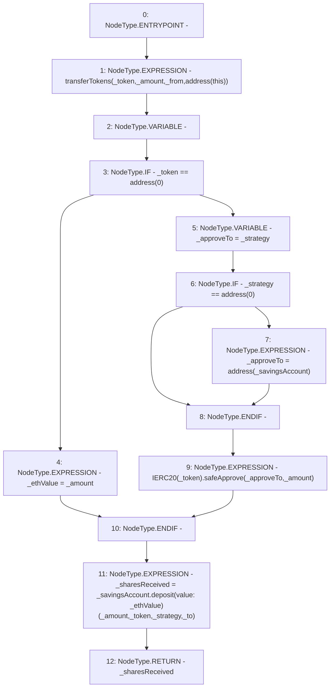

# Context: SavingsAccountUtil.directSavingsAccountDeposit

**Contract:** `SavingsAccountUtil` (Inherits: None)
**Signature:** `directSavingsAccountDeposit(ISavingsAccount,address,address,uint256,address,address) returns (uint256)`
**Method Selector ID:** `Internal (No Method ID)`
**Visibility:** `internal`
**Environment-Free:** `No (reads EVM state context)`
**Modifiers:** None

### State Variables Interaction
- **Reads:** None
- **Writes:** None

### Environment & Verification Flags
- **Uses Foundry Cheatcodes:** No
- **Has Echidna Properties:** No

### Internal Calls Tree
- None

### External Calls / Value Transfers
- `SafeERC20.LIBRARY_CALL, dest:SafeERC20, function:SafeERC20.safeApprove(IERC20,address,uint256), arguments:['TMP_2710', '_approveTo', '_amount'] `
- `ISavingsAccount.TMP_2712(uint256) = HIGH_LEVEL_CALL, dest:_savingsAccount(ISavingsAccount), function:deposit, arguments:['_amount', '_token', '_strategy', '_to'] value:_ethValue `

### Control Flow Graph (CFG)


### Source Mapping
Declared in: `contracts/SavingsAccount/SavingsAccountUtil.sol` on lines **44** to **64**

```solidity
    function directSavingsAccountDeposit(
        ISavingsAccount _savingsAccount,
        address _from,
        address _to,
        uint256 _amount,
        address _token,
        address _strategy
    ) internal returns (uint256 _sharesReceived) {
        transferTokens(_token, _amount, _from, address(this));
        uint256 _ethValue;
        if (_token == address(0)) {
            _ethValue = _amount;
        } else {
            address _approveTo = _strategy;
            if (_strategy == address(0)) {
                _approveTo = address(_savingsAccount);
            }
            IERC20(_token).safeApprove(_approveTo, _amount);
        }
        _sharesReceived = _savingsAccount.deposit{value: _ethValue}(_amount, _token, _strategy, _to);
    }

```
