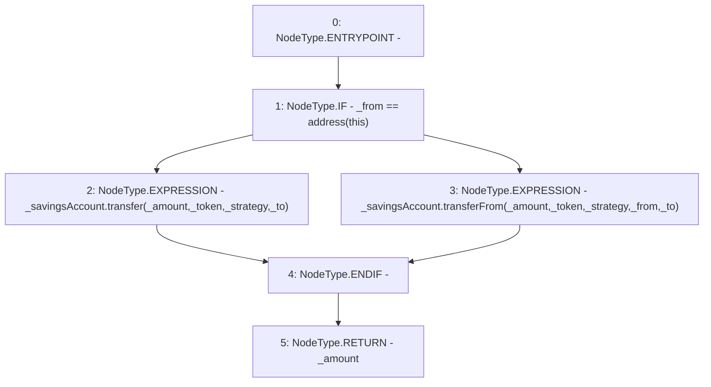

# Context: SavingsAccountUtil.savingsAccountTransfer

**Contract:** `SavingsAccountUtil` (Inherits: None)
**Signature:** `savingsAccountTransfer(ISavingsAccount,address,address,uint256,address,address) returns (uint256)`
**Method Selector ID:** `Internal (No Method ID)`
**Visibility:** `internal`
**Environment-Free:** `Yes`
**Modifiers:** None

### State Variables Interaction
- **Reads:** None
- **Writes:** None

### Environment & Verification Flags
- **Uses Foundry Cheatcodes:** No
- **Has Echidna Properties:** No

### Internal Calls Tree
- None

### External Calls / Value Transfers
- `ISavingsAccount.TMP_2716(uint256) = HIGH_LEVEL_CALL, dest:_savingsAccount(ISavingsAccount), function:transferFrom, arguments:['_amount', '_token', '_strategy', '_from', '_to']  `
- `ISavingsAccount.TMP_2715(uint256) = HIGH_LEVEL_CALL, dest:_savingsAccount(ISavingsAccount), function:transfer, arguments:['_amount', '_token', '_strategy', '_to']  `

### Control Flow Graph (CFG)


### Source Mapping
Declared in: `contracts/SavingsAccount/SavingsAccountUtil.sol` on lines **66** to **80**

```solidity
    function savingsAccountTransfer(
        ISavingsAccount _savingsAccount,
        address _from,
        address _to,
        uint256 _amount,
        address _token,
        address _strategy
    ) internal returns (uint256) {
        if (_from == address(this)) {
            _savingsAccount.transfer(_amount, _token, _strategy, _to);
        } else {
            _savingsAccount.transferFrom(_amount, _token, _strategy, _from, _to);
        }
        return _amount;
    }

```
