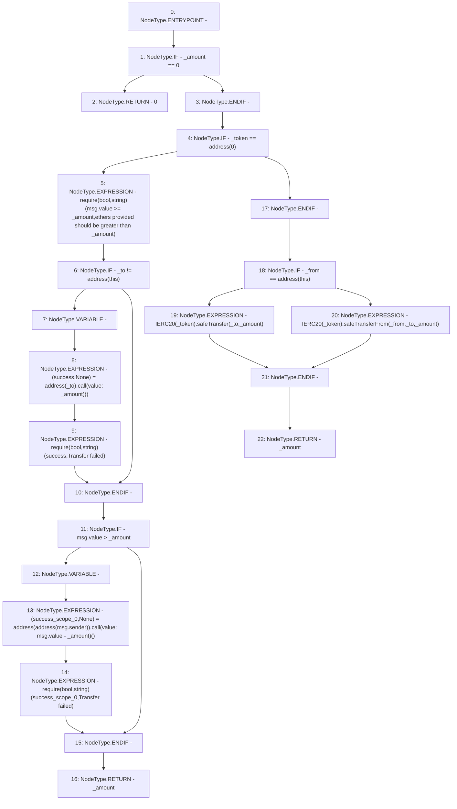

# Context: SavingsAccountUtil.transferTokens

**Contract:** `SavingsAccountUtil` (Inherits: None)
**Signature:** `transferTokens(address,uint256,address,address) returns (uint256)`
**Method Selector ID:** `Internal (No Method ID)`
**Visibility:** `internal`
**Environment-Free:** `No (reads EVM state context)`
**Modifiers:** None

### State Variables Interaction
- **Reads:** None
- **Writes:** None

### Assertion Checks & Business Requirements
- require/assert: `require(bool,string)(msg.value >= _amount,ethers provided should be greater than _amount)`
- require/assert: `require(bool,string)(success,Transfer failed)`
- require/assert: `require(bool,string)(success_scope_0,Transfer failed)`

### Environment & Verification Flags
- **Uses Foundry Cheatcodes:** No
- **Has Echidna Properties:** No

### Internal Calls Tree
- None

### External Calls / Value Transfers
- `SafeERC20.LIBRARY_CALL, dest:SafeERC20, function:SafeERC20.safeTransfer(IERC20,address,uint256), arguments:['TMP_2739', '_to', '_amount'] `
- `SafeERC20.LIBRARY_CALL, dest:SafeERC20, function:SafeERC20.safeTransferFrom(IERC20,address,address,uint256), arguments:['TMP_2741', '_from', '_to', '_amount'] `
- `low-level-call`

### Control Flow Graph (CFG)


### Source Mapping
Declared in: `contracts/SavingsAccount/SavingsAccountUtil.sol` on lines **98** to **127**

```solidity
    function transferTokens(
        address _token,
        uint256 _amount,
        address _from,
        address _to
    ) internal returns (uint256) {
        if (_amount == 0) {
            return 0;
        }
        if (_token == address(0)) {
            require(msg.value >= _amount, 'ethers provided should be greater than _amount');

            if (_to != address(this)) {
                (bool success, ) = payable(_to).call{value: _amount}('');
                require(success, 'Transfer failed');
            }
            if (msg.value > _amount) {
                (bool success, ) = payable(address(msg.sender)).call{value: msg.value - _amount}('');
                require(success, 'Transfer failed');
            }
            return _amount;
        }
        if (_from == address(this)) {
            IERC20(_token).safeTransfer(_to, _amount);
        } else {
            //pool
            IERC20(_token).safeTransferFrom(_from, _to, _amount);
        }
        return _amount;
    }

```
