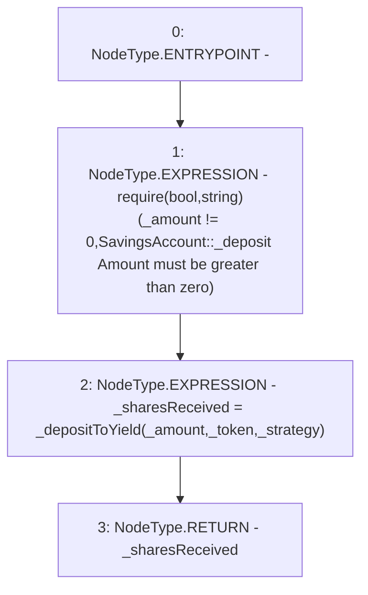

# Context: SavingsAccount._deposit

**Contract:** `SavingsAccount` (Inherits: ReentrancyGuard, OwnableUpgradeable, ContextUpgradeable, Initializable, ISavingsAccount)
**Signature:** `_deposit(uint256,address,address) returns (uint256)`
**Method Selector ID:** `Internal (No Method ID)`
**Visibility:** `internal`
**Environment-Free:** `No (reads EVM state context)`
**Modifiers:** None

### State Variables Interaction
- **Reads:** None
- **Writes:** None

### Assertion Checks & Business Requirements
- require/assert: `require(bool,string)(_amount != 0,SavingsAccount::_deposit Amount must be greater than zero)`

### Environment & Verification Flags
- **Uses Foundry Cheatcodes:** No
- **Has Echidna Properties:** No

### Internal Calls Tree
- None

### External Calls / Value Transfers
- None

### Control Flow Graph (CFG)


### Source Mapping
Declared in: `contracts/SavingsAccount/SavingsAccount.sol` on lines **121** to **128**

```solidity
    function _deposit(
        uint256 _amount,
        address _token,
        address _strategy
    ) internal returns (uint256 _sharesReceived) {
        require(_amount != 0, 'SavingsAccount::_deposit Amount must be greater than zero');
        _sharesReceived = _depositToYield(_amount, _token, _strategy);
    }

```
