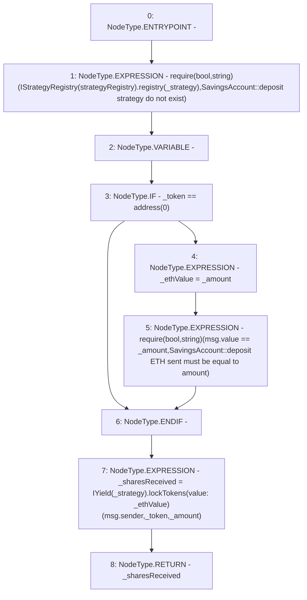

# Context: SavingsAccount._depositToYield

**Contract:** `SavingsAccount` (Inherits: ReentrancyGuard, OwnableUpgradeable, ContextUpgradeable, Initializable, ISavingsAccount)
**Signature:** `_depositToYield(uint256,address,address) returns (uint256)`
**Method Selector ID:** `Internal (No Method ID)`
**Visibility:** `internal`
**Environment-Free:** `No (reads EVM state context)`
**Modifiers:** None

### State Variables Interaction
- **Reads:** strategyRegistry
- **Writes:** None

### Assertion Checks & Business Requirements
- require/assert: `require(bool,string)(IStrategyRegistry(strategyRegistry).registry(_strategy),SavingsAccount::deposit strategy do not exist)`
- require/assert: `require(bool,string)(msg.value == _amount,SavingsAccount::deposit ETH sent must be equal to amount)`

### Environment & Verification Flags
- **Uses Foundry Cheatcodes:** No
- **Has Echidna Properties:** No

### Internal Calls Tree
- None

### External Calls / Value Transfers
- `IYield.TMP_2572(uint256) = HIGH_LEVEL_CALL, dest:TMP_2571(IYield), function:lockTokens, arguments:['msg.sender', '_token', '_amount'] value:_ethValue `
- `IStrategyRegistry.TMP_2565(bool) = HIGH_LEVEL_CALL, dest:TMP_2564(IStrategyRegistry), function:registry, arguments:['_strategy']  `

### Control Flow Graph (CFG)


### Source Mapping
Declared in: `contracts/SavingsAccount/SavingsAccount.sol` on lines **130** to **143**

```solidity
    function _depositToYield(
        uint256 _amount,
        address _token,
        address _strategy
    ) internal returns (uint256 _sharesReceived) {
        require(IStrategyRegistry(strategyRegistry).registry(_strategy), 'SavingsAccount::deposit strategy do not exist');
        uint256 _ethValue;

        if (_token == address(0)) {
            _ethValue = _amount;
            require(msg.value == _amount, 'SavingsAccount::deposit ETH sent must be equal to amount');
        }
        _sharesReceived = IYield(_strategy).lockTokens{value: _ethValue}(msg.sender, _token, _amount);
    }

```
