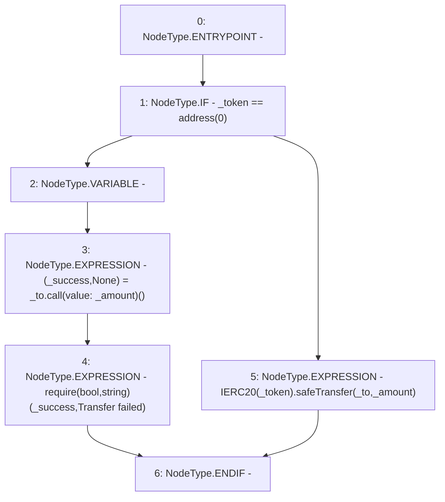

# Context: SavingsAccount._transfer

**Contract:** `SavingsAccount` (Inherits: ReentrancyGuard, OwnableUpgradeable, ContextUpgradeable, Initializable, ISavingsAccount)
**Signature:** `_transfer(uint256,address,address)`
**Method Selector ID:** `Internal (No Method ID)`
**Visibility:** `internal`
**Environment-Free:** `Yes`
**Modifiers:** None

### State Variables Interaction
- **Reads:** None
- **Writes:** None

### Assertion Checks & Business Requirements
- require/assert: `require(bool,string)(_success,Transfer failed)`

### Environment & Verification Flags
- **Uses Foundry Cheatcodes:** No
- **Has Echidna Properties:** No

### Internal Calls Tree
- None

### External Calls / Value Transfers
- `low-level-call`
- `SafeERC20.LIBRARY_CALL, dest:SafeERC20, function:SafeERC20.safeTransfer(IERC20,address,uint256), arguments:['TMP_2623', '_to', '_amount'] `

### Control Flow Graph (CFG)


### Source Mapping
Declared in: `contracts/SavingsAccount/SavingsAccount.sol` on lines **269** to **280**

```solidity
    function _transfer(
        uint256 _amount,
        address _token,
        address payable _to
    ) internal {
        if (_token == address(0)) {
            (bool _success, ) = _to.call{value: _amount}('');
            require(_success, 'Transfer failed');
        } else {
            IERC20(_token).safeTransfer(_to, _amount);
        }
    }

```
