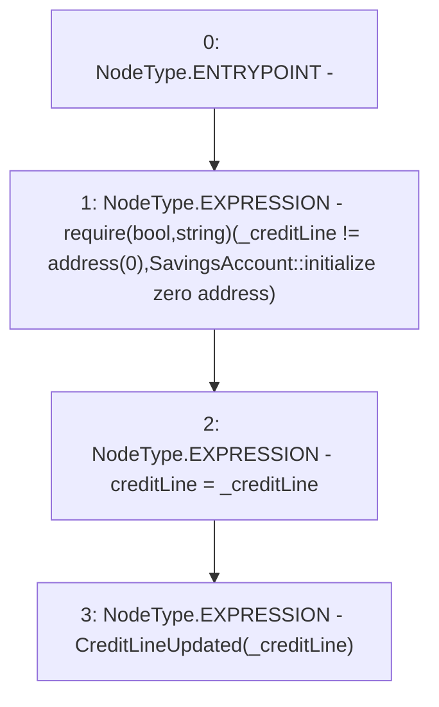

# Context: SavingsAccount._updateCreditLine

**Contract:** `SavingsAccount` (Inherits: ReentrancyGuard, OwnableUpgradeable, ContextUpgradeable, Initializable, ISavingsAccount)
**Signature:** `_updateCreditLine(address)`
**Method Selector ID:** `Internal (No Method ID)`
**Visibility:** `internal`
**Environment-Free:** `Yes`
**Modifiers:** None

### State Variables Interaction
- **Reads:** None
- **Writes:** creditLine

### Assertion Checks & Business Requirements
- require/assert: `require(bool,string)(_creditLine != address(0),SavingsAccount::initialize zero address)`

### Environment & Verification Flags
- **Uses Foundry Cheatcodes:** No
- **Has Echidna Properties:** No

### Internal Calls Tree
- None

### External Calls / Value Transfers
- None

### Control Flow Graph (CFG)


### Source Mapping
Declared in: `contracts/SavingsAccount/SavingsAccount.sol` on lines **79** to **83**

```solidity
    function _updateCreditLine(address _creditLine) internal {
        require(_creditLine != address(0), 'SavingsAccount::initialize zero address');
        creditLine = _creditLine;
        emit CreditLineUpdated(_creditLine);
    }

```
