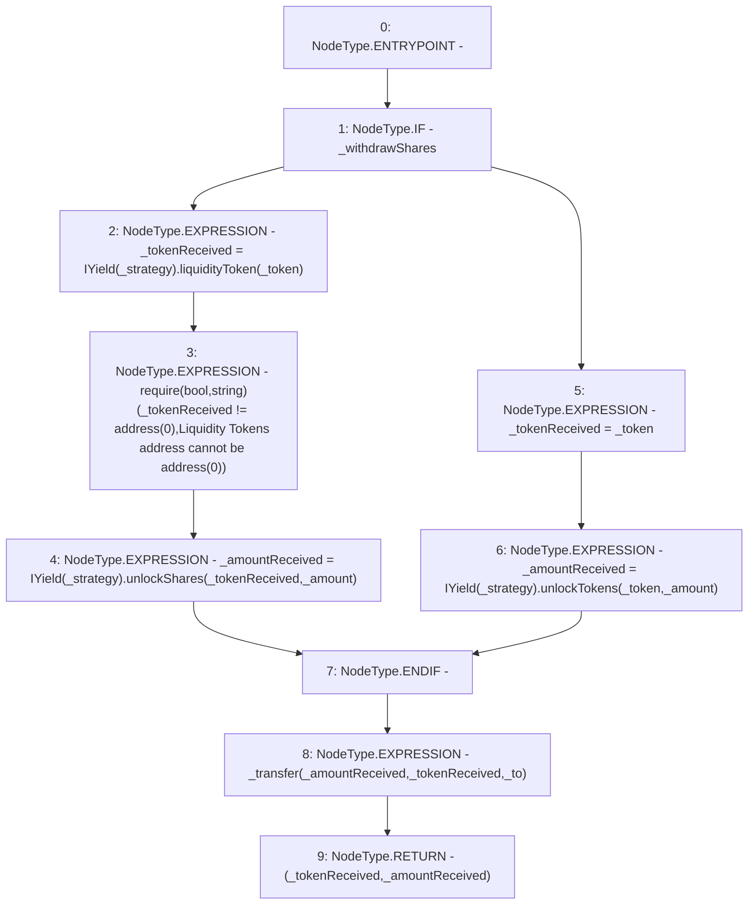

# Context: SavingsAccount._withdraw

**Contract:** `SavingsAccount` (Inherits: ReentrancyGuard, OwnableUpgradeable, ContextUpgradeable, Initializable, ISavingsAccount)
**Signature:** `_withdraw(uint256,address,address,address,bool) returns (address, uint256)`
**Method Selector ID:** `Internal (No Method ID)`
**Visibility:** `internal`
**Environment-Free:** `Yes`
**Modifiers:** None

### State Variables Interaction
- **Reads:** None
- **Writes:** None

### Assertion Checks & Business Requirements
- require/assert: `require(bool,string)(_tokenReceived != address(0),Liquidity Tokens address cannot be address(0))`

### Environment & Verification Flags
- **Uses Foundry Cheatcodes:** No
- **Has Echidna Properties:** No

### Internal Calls Tree
- None

### External Calls / Value Transfers
- `IYield.TMP_2616(uint256) = HIGH_LEVEL_CALL, dest:TMP_2615(IYield), function:unlockShares, arguments:['_tokenReceived', '_amount']  `
- `IYield.TMP_2618(uint256) = HIGH_LEVEL_CALL, dest:TMP_2617(IYield), function:unlockTokens, arguments:['_token', '_amount']  `
- `IYield.TMP_2611(address) = HIGH_LEVEL_CALL, dest:TMP_2610(IYield), function:liquidityToken, arguments:['_token']  `

### Control Flow Graph (CFG)


### Source Mapping
Declared in: `contracts/SavingsAccount/SavingsAccount.sol` on lines **251** to **267**

```solidity
    function _withdraw(
        uint256 _amount,
        address _token,
        address _strategy,
        address payable _to,
        bool _withdrawShares
    ) internal returns (address _tokenReceived, uint256 _amountReceived) {
        if (_withdrawShares) {
            _tokenReceived = IYield(_strategy).liquidityToken(_token);
            require(_tokenReceived != address(0), 'Liquidity Tokens address cannot be address(0)');
            _amountReceived = IYield(_strategy).unlockShares(_tokenReceived, _amount);
        } else {
            _tokenReceived = _token;
            _amountReceived = IYield(_strategy).unlockTokens(_token, _amount);
        }
        _transfer(_amountReceived, _tokenReceived, _to);
    }

```
