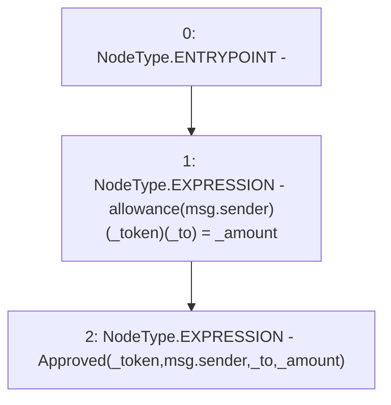

# Context: SavingsAccount.approve

**Contract:** `SavingsAccount` (Inherits: ReentrancyGuard, OwnableUpgradeable, ContextUpgradeable, Initializable, ISavingsAccount)
**Signature:** `approve(uint256,address,address)`
**Method Selector ID:** `0x2fac5d9f`
**Visibility:** `external`
**Environment-Free:** `No (reads EVM state context)`
**Modifiers:** None

### State Variables Interaction
- **Reads:** None
- **Writes:** allowance

### Environment & Verification Flags
- **Uses Foundry Cheatcodes:** No
- **Has Echidna Properties:** No

### Internal Calls Tree
- None

### External Calls / Value Transfers
- None

### Control Flow Graph (CFG)


### Source Mapping
Declared in: `contracts/SavingsAccount/SavingsAccount.sol` on lines **326** to **334**

```solidity
    function approve(
        uint256 _amount,
        address _token,
        address _to
    ) external override {
        allowance[msg.sender][_token][_to] = _amount;

        emit Approved(_token, msg.sender, _to, _amount);
    }

```
