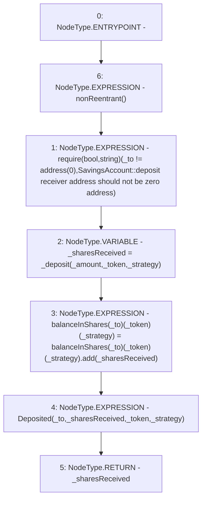

# Context: SavingsAccount.deposit

**Contract:** `SavingsAccount` (Inherits: ReentrancyGuard, OwnableUpgradeable, ContextUpgradeable, Initializable, ISavingsAccount)
**Signature:** `deposit(uint256,address,address,address) returns (uint256)`
**Method Selector ID:** `0xc250283c`
**Visibility:** `external`
**Environment-Free:** `No (reads EVM state context)`
**Modifiers:**
- `nonReentrant`
  ```solidity
  modifier nonReentrant() {
          // On the first call to nonReentrant, _notEntered will be true
          require(_status != _ENTERED, "ReentrancyGuard: reentrant call");
  
          // Any calls to nonReentrant after this point will fail
          _status = _ENTERED;
  
          _;
  
          // By storing the original value once again, a refund is triggered (see
          // https://eips.ethereum.org/EIPS/eip-2200)
          _status = _NOT_ENTERED;
      }
  ```

### State Variables Interaction
- **Reads:** balanceInShares
- **Writes:** balanceInShares

### Assertion Checks & Business Requirements
- require/assert: `require(bool,string)(_to != address(0),SavingsAccount::deposit receiver address should not be zero address)`

### Environment & Verification Flags
- **Uses Foundry Cheatcodes:** No
- **Has Echidna Properties:** No

### Internal Calls Tree
- None

### External Calls / Value Transfers
- `SafeMath.TMP_2558(uint256) = LIBRARY_CALL, dest:SafeMath, function:SafeMath.add(uint256,uint256), arguments:['REF_1138', '_sharesReceived'] `

### Control Flow Graph (CFG)


### Source Mapping
Declared in: `contracts/SavingsAccount/SavingsAccount.sol` on lines **108** to **119**

```solidity
    function deposit(
        uint256 _amount,
        address _token,
        address _strategy,
        address _to
    ) external payable override nonReentrant returns (uint256) {
        require(_to != address(0), 'SavingsAccount::deposit receiver address should not be zero address');
        uint256 _sharesReceived = _deposit(_amount, _token, _strategy);
        balanceInShares[_to][_token][_strategy] = balanceInShares[_to][_token][_strategy].add(_sharesReceived);
        emit Deposited(_to, _sharesReceived, _token, _strategy);
        return _sharesReceived;
    }

```
