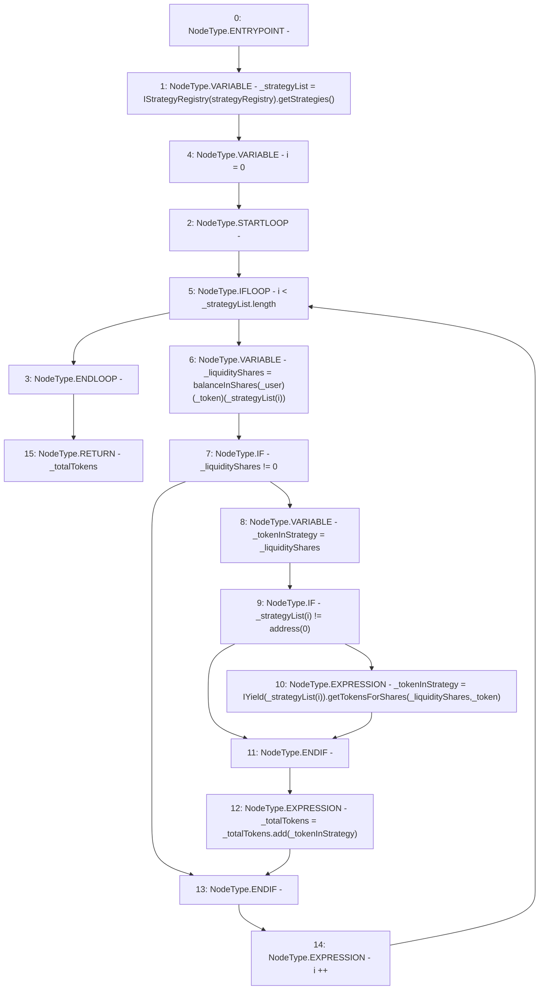

# Context: SavingsAccount.getTotalTokens

**Contract:** `SavingsAccount` (Inherits: ReentrancyGuard, OwnableUpgradeable, ContextUpgradeable, Initializable, ISavingsAccount)
**Signature:** `getTotalTokens(address,address) returns (uint256)`
**Method Selector ID:** `0xab608e0b`
**Visibility:** `external`
**Environment-Free:** `Yes`
**Modifiers:** None

### State Variables Interaction
- **Reads:** balanceInShares, strategyRegistry
- **Writes:** None

### Environment & Verification Flags
- **Uses Foundry Cheatcodes:** No
- **Has Echidna Properties:** No

### Internal Calls Tree
- None

### External Calls / Value Transfers
- `IYield.TMP_2682(uint256) = HIGH_LEVEL_CALL, dest:TMP_2681(IYield), function:getTokensForShares, arguments:['_liquidityShares', '_token']  `
- `SafeMath.TMP_2683(uint256) = LIBRARY_CALL, dest:SafeMath, function:SafeMath.add(uint256,uint256), arguments:['_totalTokens', '_tokenInStrategy'] `
- `IStrategyRegistry.TMP_2676(address[]) = HIGH_LEVEL_CALL, dest:TMP_2675(IStrategyRegistry), function:getStrategies, arguments:[]  `

### Control Flow Graph (CFG)


### Source Mapping
Declared in: `contracts/SavingsAccount/SavingsAccount.sol` on lines **464** to **479**

```solidity
    function getTotalTokens(address _user, address _token) external override returns (uint256 _totalTokens) {
        address[] memory _strategyList = IStrategyRegistry(strategyRegistry).getStrategies();

        for (uint256 i = 0; i < _strategyList.length; i++) {
            uint256 _liquidityShares = balanceInShares[_user][_token][_strategyList[i]];

            if (_liquidityShares != 0) {
                uint256 _tokenInStrategy = _liquidityShares;
                if (_strategyList[i] != address(0)) {
                    _tokenInStrategy = IYield(_strategyList[i]).getTokensForShares(_liquidityShares, _token);
                }

                _totalTokens = _totalTokens.add(_tokenInStrategy);
            }
        }
    }

```
