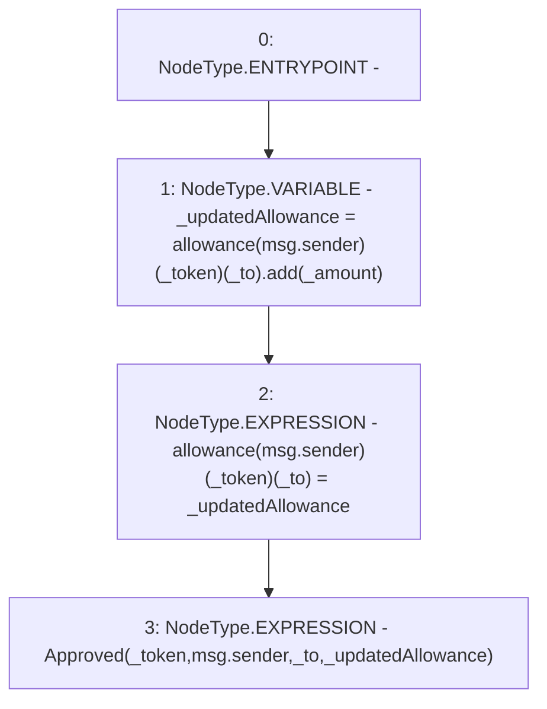

# Context: SavingsAccount.increaseAllowance

**Contract:** `SavingsAccount` (Inherits: ReentrancyGuard, OwnableUpgradeable, ContextUpgradeable, Initializable, ISavingsAccount)
**Signature:** `increaseAllowance(uint256,address,address)`
**Method Selector ID:** `0x11c35928`
**Visibility:** `external`
**Environment-Free:** `No (reads EVM state context)`
**Modifiers:** None

### State Variables Interaction
- **Reads:** allowance
- **Writes:** allowance

### Environment & Verification Flags
- **Uses Foundry Cheatcodes:** No
- **Has Echidna Properties:** No

### Internal Calls Tree
- None

### External Calls / Value Transfers
- `SafeMath.TMP_2649(uint256) = LIBRARY_CALL, dest:SafeMath, function:SafeMath.add(uint256,uint256), arguments:['REF_1223', '_amount'] `

### Control Flow Graph (CFG)


### Source Mapping
Declared in: `contracts/SavingsAccount/SavingsAccount.sol` on lines **342** to **351**

```solidity
    function increaseAllowance(
        uint256 _amount,
        address _token,
        address _to
    ) external override {
        uint256 _updatedAllowance = allowance[msg.sender][_token][_to].add(_amount);
        allowance[msg.sender][_token][_to] = _updatedAllowance;

        emit Approved(_token, msg.sender, _to, _updatedAllowance);
    }

```
