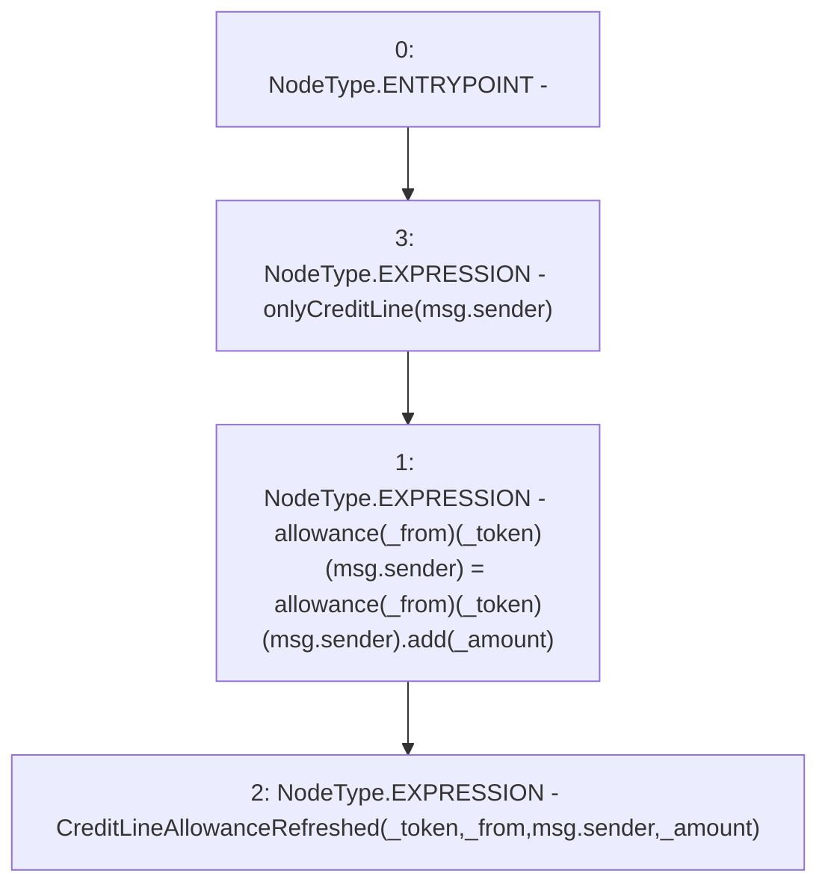

# Context: SavingsAccount.increaseAllowanceToCreditLine

**Contract:** `SavingsAccount` (Inherits: ReentrancyGuard, OwnableUpgradeable, ContextUpgradeable, Initializable, ISavingsAccount)
**Signature:** `increaseAllowanceToCreditLine(uint256,address,address)`
**Method Selector ID:** `0x5895a8e9`
**Visibility:** `external`
**Environment-Free:** `No (reads EVM state context)`
**Modifiers:**
- `onlyCreditLine`
  ```solidity
  modifier onlyCreditLine(address _caller) {
          require(_caller == creditLine, 'Invalid caller');
          _;
      }
  ```

### State Variables Interaction
- **Reads:** allowance
- **Writes:** allowance

### Environment & Verification Flags
- **Uses Foundry Cheatcodes:** No
- **Has Echidna Properties:** No

### Internal Calls Tree
- None

### External Calls / Value Transfers
- `SafeMath.TMP_2653(uint256) = LIBRARY_CALL, dest:SafeMath, function:SafeMath.add(uint256,uint256), arguments:['REF_1240', '_amount'] `

### Control Flow Graph (CFG)


### Source Mapping
Declared in: `contracts/SavingsAccount/SavingsAccount.sol` on lines **376** to **384**

```solidity
    function increaseAllowanceToCreditLine(
        uint256 _amount,
        address _token,
        address _from
    ) external override onlyCreditLine(msg.sender) {
        allowance[_from][_token][msg.sender] = allowance[_from][_token][msg.sender].add(_amount);

        emit CreditLineAllowanceRefreshed(_token, _from, msg.sender, _amount);
    }

```
