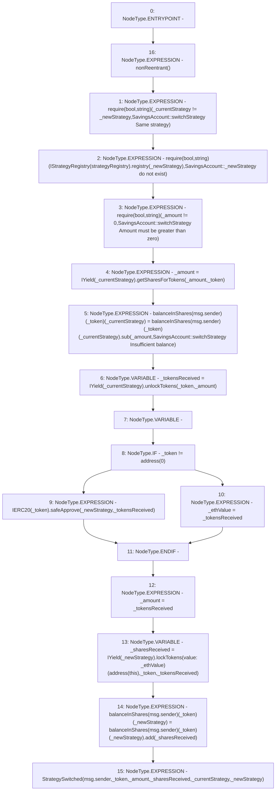

# Context: SavingsAccount.switchStrategy

**Contract:** `SavingsAccount` (Inherits: ReentrancyGuard, OwnableUpgradeable, ContextUpgradeable, Initializable, ISavingsAccount)
**Signature:** `switchStrategy(uint256,address,address,address)`
**Method Selector ID:** `0xb98ad570`
**Visibility:** `external`
**Environment-Free:** `No (reads EVM state context)`
**Modifiers:**
- `nonReentrant`
  ```solidity
  modifier nonReentrant() {
          // On the first call to nonReentrant, _notEntered will be true
          require(_status != _ENTERED, "ReentrancyGuard: reentrant call");
  
          // Any calls to nonReentrant after this point will fail
          _status = _ENTERED;
  
          _;
  
          // By storing the original value once again, a refund is triggered (see
          // https://eips.ethereum.org/EIPS/eip-2200)
          _status = _NOT_ENTERED;
      }
  ```

### State Variables Interaction
- **Reads:** balanceInShares, strategyRegistry
- **Writes:** balanceInShares

### Assertion Checks & Business Requirements
- require/assert: `require(bool,string)(_currentStrategy != _newStrategy,SavingsAccount::switchStrategy Same strategy)`
- require/assert: `require(bool,string)(IStrategyRegistry(strategyRegistry).registry(_newStrategy),SavingsAccount::_newStrategy do not exist)`
- require/assert: `require(bool,string)(_amount != 0,SavingsAccount::switchStrategy Amount must be greater than zero)`

### Environment & Verification Flags
- **Uses Foundry Cheatcodes:** No
- **Has Echidna Properties:** No

### Internal Calls Tree
- None

### External Calls / Value Transfers
- `IStrategyRegistry.TMP_2576(bool) = HIGH_LEVEL_CALL, dest:TMP_2575(IStrategyRegistry), function:registry, arguments:['_newStrategy']  `
- `SafeMath.TMP_2592(uint256) = LIBRARY_CALL, dest:SafeMath, function:SafeMath.add(uint256,uint256), arguments:['REF_1159', '_sharesReceived'] `
- `IYield.TMP_2584(uint256) = HIGH_LEVEL_CALL, dest:TMP_2583(IYield), function:unlockTokens, arguments:['_token', '_amount']  `
- `SafeMath.TMP_2582(uint256) = LIBRARY_CALL, dest:SafeMath, function:SafeMath.sub(uint256,uint256,string), arguments:['REF_1149', '_amount', 'SavingsAccount::switchStrategy Insufficient balance'] `
- `SafeERC20.LIBRARY_CALL, dest:SafeERC20, function:SafeERC20.safeApprove(IERC20,address,uint256), arguments:['TMP_2587', '_newStrategy', '_tokensReceived'] `
- `IYield.TMP_2581(uint256) = HIGH_LEVEL_CALL, dest:TMP_2580(IYield), function:getSharesForTokens, arguments:['_amount', '_token']  `
- `IYield.TMP_2591(uint256) = HIGH_LEVEL_CALL, dest:TMP_2589(IYield), function:lockTokens, arguments:['TMP_2590', '_token', '_tokensReceived'] value:_ethValue `

### Control Flow Graph (CFG)


### Source Mapping
Declared in: `contracts/SavingsAccount/SavingsAccount.sol` on lines **152** to **183**

```solidity
    function switchStrategy(
        uint256 _amount,
        address _token,
        address _currentStrategy,
        address _newStrategy
    ) external override nonReentrant {
        require(_currentStrategy != _newStrategy, 'SavingsAccount::switchStrategy Same strategy');
        require(IStrategyRegistry(strategyRegistry).registry(_newStrategy), 'SavingsAccount::_newStrategy do not exist');
        require(_amount != 0, 'SavingsAccount::switchStrategy Amount must be greater than zero');

        _amount = IYield(_currentStrategy).getSharesForTokens(_amount, _token);

        balanceInShares[msg.sender][_token][_currentStrategy] = balanceInShares[msg.sender][_token][_currentStrategy].sub(
            _amount,
            'SavingsAccount::switchStrategy Insufficient balance'
        );

        uint256 _tokensReceived = IYield(_currentStrategy).unlockTokens(_token, _amount);

        uint256 _ethValue;
        if (_token != address(0)) {
            IERC20(_token).safeApprove(_newStrategy, _tokensReceived);
        } else {
            _ethValue = _tokensReceived;
        }
        _amount = _tokensReceived;
        
        uint256 _sharesReceived = IYield(_newStrategy).lockTokens{value: _ethValue}(address(this), _token, _tokensReceived);

        balanceInShares[msg.sender][_token][_newStrategy] = balanceInShares[msg.sender][_token][_newStrategy].add(_sharesReceived);
        emit StrategySwitched(msg.sender, _token, _amount, _sharesReceived, _currentStrategy, _newStrategy);
    }

```
