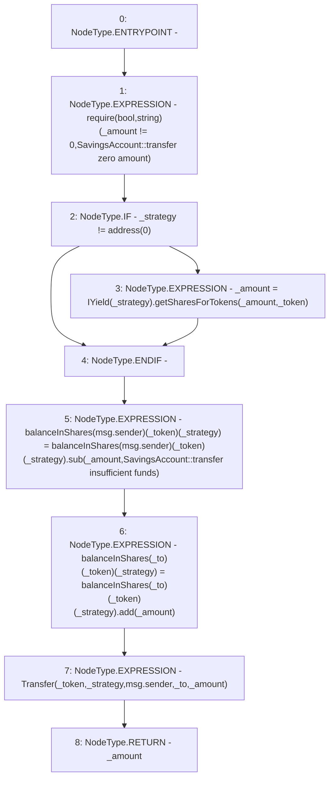

# Context: SavingsAccount.transfer

**Contract:** `SavingsAccount` (Inherits: ReentrancyGuard, OwnableUpgradeable, ContextUpgradeable, Initializable, ISavingsAccount)
**Signature:** `transfer(uint256,address,address,address) returns (uint256)`
**Method Selector ID:** `0x89172072`
**Visibility:** `external`
**Environment-Free:** `No (reads EVM state context)`
**Modifiers:** None

### State Variables Interaction
- **Reads:** balanceInShares
- **Writes:** balanceInShares

### Assertion Checks & Business Requirements
- require/assert: `require(bool,string)(_amount != 0,SavingsAccount::transfer zero amount)`

### Environment & Verification Flags
- **Uses Foundry Cheatcodes:** No
- **Has Echidna Properties:** No

### Internal Calls Tree
- None

### External Calls / Value Transfers
- `SafeMath.TMP_2663(uint256) = LIBRARY_CALL, dest:SafeMath, function:SafeMath.add(uint256,uint256), arguments:['REF_1255', '_amount'] `
- `IYield.TMP_2661(uint256) = HIGH_LEVEL_CALL, dest:TMP_2660(IYield), function:getSharesForTokens, arguments:['_amount', '_token']  `
- `TMP_2657(None) = SOLIDITY_CALL require(bool,string)(TMP_2656,SavingsAccount::transfer zero amount)`
- `SafeMath.TMP_2662(uint256) = LIBRARY_CALL, dest:SafeMath, function:SafeMath.sub(uint256,uint256,string), arguments:['REF_1248', '_amount', 'SavingsAccount::transfer insufficient funds'] `

### Control Flow Graph (CFG)


### Source Mapping
Declared in: `contracts/SavingsAccount/SavingsAccount.sol` on lines **393** to **416**

```solidity
    function transfer(
        uint256 _amount,
        address _token,
        address _strategy,
        address _to
    ) external override returns (uint256) {
        require(_amount != 0, 'SavingsAccount::transfer zero amount');

        if (_strategy != address(0)) {
            _amount = IYield(_strategy).getSharesForTokens(_amount, _token);
        }

        balanceInShares[msg.sender][_token][_strategy] = balanceInShares[msg.sender][_token][_strategy].sub(
            _amount,
            'SavingsAccount::transfer insufficient funds'
        );

        //update receiver's balance
        balanceInShares[_to][_token][_strategy] = balanceInShares[_to][_token][_strategy].add(_amount);

        emit Transfer(_token, _strategy, msg.sender, _to, _amount);

        return _amount;
    }

```
