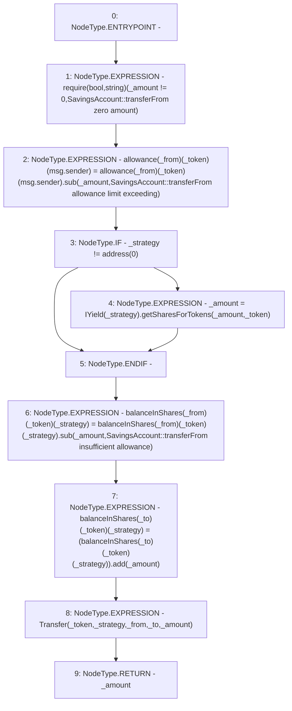

# Context: SavingsAccount.transferFrom

**Contract:** `SavingsAccount` (Inherits: ReentrancyGuard, OwnableUpgradeable, ContextUpgradeable, Initializable, ISavingsAccount)
**Signature:** `transferFrom(uint256,address,address,address,address) returns (uint256)`
**Method Selector ID:** `0x33b5a1ba`
**Visibility:** `external`
**Environment-Free:** `No (reads EVM state context)`
**Modifiers:** None

### State Variables Interaction
- **Reads:** allowance, balanceInShares
- **Writes:** allowance, balanceInShares

### Assertion Checks & Business Requirements
- require/assert: `require(bool,string)(_amount != 0,SavingsAccount::transferFrom zero amount)`

### Environment & Verification Flags
- **Uses Foundry Cheatcodes:** No
- **Has Echidna Properties:** No

### Internal Calls Tree
- None

### External Calls / Value Transfers
- `IYield.TMP_2671(uint256) = HIGH_LEVEL_CALL, dest:TMP_2670(IYield), function:getSharesForTokens, arguments:['_amount', '_token']  `
- `SafeMath.TMP_2672(uint256) = LIBRARY_CALL, dest:SafeMath, function:SafeMath.sub(uint256,uint256,string), arguments:['REF_1270', '_amount', 'SavingsAccount::transferFrom insufficient allowance'] `
- `SafeMath.TMP_2673(uint256) = LIBRARY_CALL, dest:SafeMath, function:SafeMath.add(uint256,uint256), arguments:['REF_1277', '_amount'] `
- `TMP_2666(None) = SOLIDITY_CALL require(bool,string)(TMP_2665,SavingsAccount::transferFrom zero amount)`
- `SafeMath.TMP_2667(uint256) = LIBRARY_CALL, dest:SafeMath, function:SafeMath.sub(uint256,uint256,string), arguments:['REF_1262', '_amount', 'SavingsAccount::transferFrom allowance limit exceeding'] `

### Control Flow Graph (CFG)


### Source Mapping
Declared in: `contracts/SavingsAccount/SavingsAccount.sol` on lines **426** to **456**

```solidity
    function transferFrom(
        uint256 _amount,
        address _token,
        address _strategy,
        address _from,
        address _to
    ) external override returns (uint256) {
        require(_amount != 0, 'SavingsAccount::transferFrom zero amount');
        //update allowance
        allowance[_from][_token][msg.sender] = allowance[_from][_token][msg.sender].sub(
            _amount,
            'SavingsAccount::transferFrom allowance limit exceeding'
        );

        if (_strategy != address(0)) {
            _amount = IYield(_strategy).getSharesForTokens(_amount, _token);
        }

        //reduce sender's balance
        balanceInShares[_from][_token][_strategy] = balanceInShares[_from][_token][_strategy].sub(
            _amount,
            'SavingsAccount::transferFrom insufficient allowance'
        );

        //update receiver's balance
        balanceInShares[_to][_token][_strategy] = (balanceInShares[_to][_token][_strategy]).add(_amount);

        emit Transfer(_token, _strategy, _from, _to, _amount);

        return _amount;
    }

```
