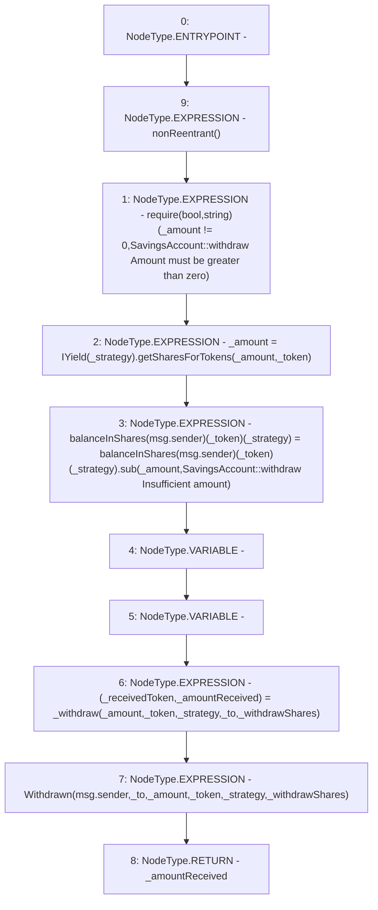

# Context: SavingsAccount.withdraw

**Contract:** `SavingsAccount` (Inherits: ReentrancyGuard, OwnableUpgradeable, ContextUpgradeable, Initializable, ISavingsAccount)
**Signature:** `withdraw(uint256,address,address,address,bool) returns (uint256)`
**Method Selector ID:** `0x45cd75e9`
**Visibility:** `external`
**Environment-Free:** `No (reads EVM state context)`
**Modifiers:**
- `nonReentrant`
  ```solidity
  modifier nonReentrant() {
          // On the first call to nonReentrant, _notEntered will be true
          require(_status != _ENTERED, "ReentrancyGuard: reentrant call");
  
          // Any calls to nonReentrant after this point will fail
          _status = _ENTERED;
  
          _;
  
          // By storing the original value once again, a refund is triggered (see
          // https://eips.ethereum.org/EIPS/eip-2200)
          _status = _NOT_ENTERED;
      }
  ```

### State Variables Interaction
- **Reads:** balanceInShares
- **Writes:** balanceInShares

### Assertion Checks & Business Requirements
- require/assert: `require(bool,string)(_amount != 0,SavingsAccount::withdraw Amount must be greater than zero)`

### Environment & Verification Flags
- **Uses Foundry Cheatcodes:** No
- **Has Echidna Properties:** No

### Internal Calls Tree
- None

### External Calls / Value Transfers
- `SafeMath.TMP_2599(uint256) = LIBRARY_CALL, dest:SafeMath, function:SafeMath.sub(uint256,uint256,string), arguments:['REF_1167', '_amount', 'SavingsAccount::withdraw Insufficient amount'] `
- `IYield.TMP_2598(uint256) = HIGH_LEVEL_CALL, dest:TMP_2597(IYield), function:getSharesForTokens, arguments:['_amount', '_token']  `

### Control Flow Graph (CFG)


### Source Mapping
Declared in: `contracts/SavingsAccount/SavingsAccount.sol` on lines **193** to **213**

```solidity
    function withdraw(
        uint256 _amount,
        address _token,
        address _strategy,
        address payable _to,
        bool _withdrawShares
    ) external override nonReentrant returns (uint256) {
        require(_amount != 0, 'SavingsAccount::withdraw Amount must be greater than zero');

        _amount = IYield(_strategy).getSharesForTokens(_amount, _token);

        balanceInShares[msg.sender][_token][_strategy] = balanceInShares[msg.sender][_token][_strategy].sub(
            _amount,
            'SavingsAccount::withdraw Insufficient amount'
        );

        (address _receivedToken, uint256 _amountReceived) = _withdraw(_amount, _token, _strategy, _to, _withdrawShares);

        emit Withdrawn(msg.sender, _to, _amount, _token, _strategy, _withdrawShares);
        return _amountReceived;
    }

```
