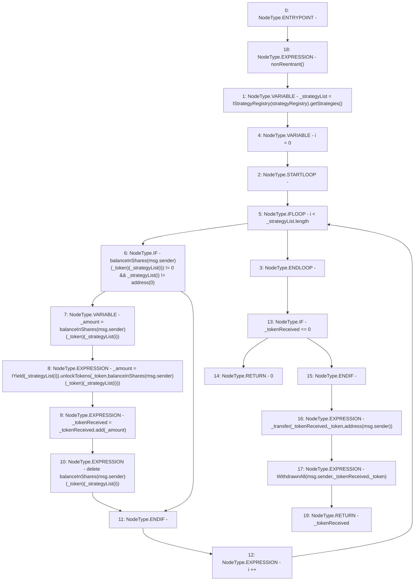

# Context: SavingsAccount.withdrawAll

**Contract:** `SavingsAccount` (Inherits: ReentrancyGuard, OwnableUpgradeable, ContextUpgradeable, Initializable, ISavingsAccount)
**Signature:** `withdrawAll(address) returns (uint256)`
**Method Selector ID:** `0xfa09e630`
**Visibility:** `external`
**Environment-Free:** `No (reads EVM state context)`
**Modifiers:**
- `nonReentrant`
  ```solidity
  modifier nonReentrant() {
          // On the first call to nonReentrant, _notEntered will be true
          require(_status != _ENTERED, "ReentrancyGuard: reentrant call");
  
          // Any calls to nonReentrant after this point will fail
          _status = _ENTERED;
  
          _;
  
          // By storing the original value once again, a refund is triggered (see
          // https://eips.ethereum.org/EIPS/eip-2200)
          _status = _NOT_ENTERED;
      }
  ```

### State Variables Interaction
- **Reads:** balanceInShares, strategyRegistry
- **Writes:** balanceInShares

### Environment & Verification Flags
- **Uses Foundry Cheatcodes:** No
- **Has Echidna Properties:** No

### Internal Calls Tree
- None

### External Calls / Value Transfers
- `IYield.TMP_2633(uint256) = HIGH_LEVEL_CALL, dest:TMP_2632(IYield), function:unlockTokens, arguments:['_token', 'REF_1205']  `
- `IStrategyRegistry.TMP_2626(address[]) = HIGH_LEVEL_CALL, dest:TMP_2625(IStrategyRegistry), function:getStrategies, arguments:[]  `
- `SafeMath.TMP_2634(uint256) = LIBRARY_CALL, dest:SafeMath, function:SafeMath.add(uint256,uint256), arguments:['_tokenReceived', '_amount'] `

### Control Flow Graph (CFG)


### Source Mapping
Declared in: `contracts/SavingsAccount/SavingsAccount.sol` on lines **286** to **303**

```solidity
    function withdrawAll(address _token) external override nonReentrant returns (uint256 _tokenReceived) {
        address[] memory _strategyList = IStrategyRegistry(strategyRegistry).getStrategies();

        for (uint256 i = 0; i < _strategyList.length; i++) {
            if (balanceInShares[msg.sender][_token][_strategyList[i]] != 0 && _strategyList[i] != address(0)) {
                uint256 _amount = balanceInShares[msg.sender][_token][_strategyList[i]];
                _amount = IYield(_strategyList[i]).unlockTokens(_token, balanceInShares[msg.sender][_token][_strategyList[i]]);
                _tokenReceived = _tokenReceived.add(_amount);
                delete balanceInShares[msg.sender][_token][_strategyList[i]];
            }
        }

        if (_tokenReceived == 0) return 0;

        _transfer(_tokenReceived, _token, payable(msg.sender));

        emit WithdrawnAll(msg.sender, _tokenReceived, _token);
    }

```
