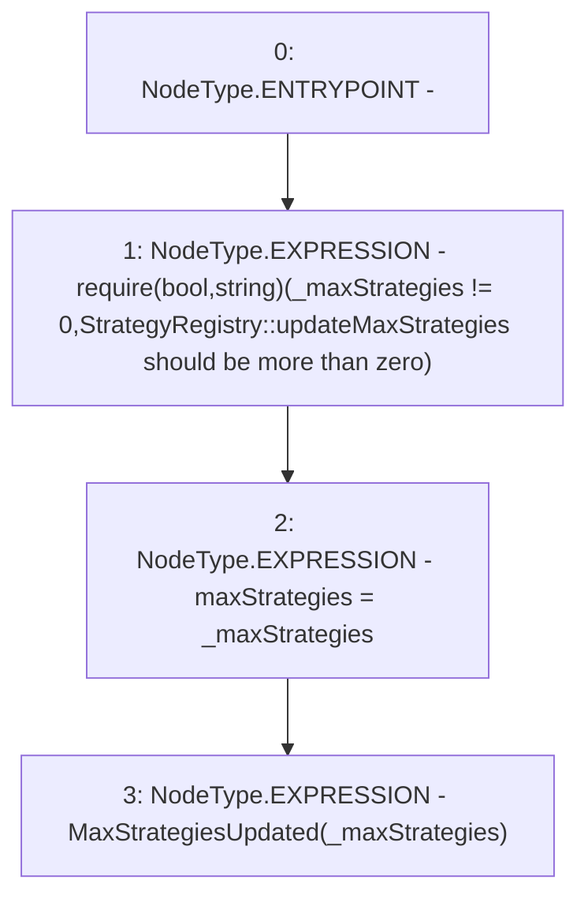

# Context: StrategyRegistry._updateMaxStrategies

**Contract:** `StrategyRegistry` (Inherits: IStrategyRegistry, OwnableUpgradeable, ContextUpgradeable, Initializable)
**Signature:** `_updateMaxStrategies(uint256)`
**Method Selector ID:** `Internal (No Method ID)`
**Visibility:** `internal`
**Environment-Free:** `Yes`
**Modifiers:** None

### State Variables Interaction
- **Reads:** None
- **Writes:** maxStrategies

### Assertion Checks & Business Requirements
- require/assert: `require(bool,string)(_maxStrategies != 0,StrategyRegistry::updateMaxStrategies should be more than zero)`

### Environment & Verification Flags
- **Uses Foundry Cheatcodes:** No
- **Has Echidna Properties:** No

### Internal Calls Tree
- None

### External Calls / Value Transfers
- None

### Control Flow Graph (CFG)


### Source Mapping
Declared in: `contracts/yield/StrategyRegistry.sol` on lines **50** to **54**

```solidity
    function _updateMaxStrategies(uint256 _maxStrategies) internal {
        require(_maxStrategies != 0, 'StrategyRegistry::updateMaxStrategies should be more than zero');
        maxStrategies = _maxStrategies;
        emit MaxStrategiesUpdated(_maxStrategies);
    }

```
