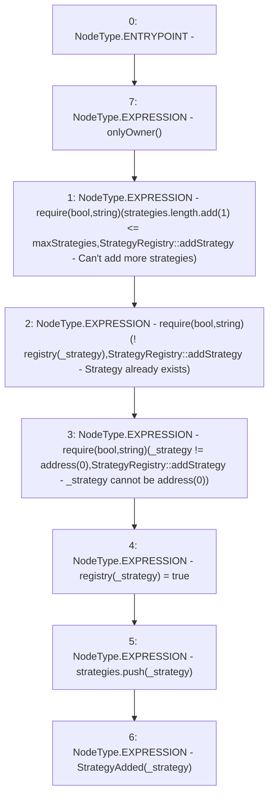

# Context: StrategyRegistry.addStrategy

**Contract:** `StrategyRegistry` (Inherits: IStrategyRegistry, OwnableUpgradeable, ContextUpgradeable, Initializable)
**Signature:** `addStrategy(address)`
**Method Selector ID:** `0x223e5479`
**Visibility:** `external`
**Environment-Free:** `No (reads EVM state context)`
**Modifiers:**
- `onlyOwner`
  ```solidity
  modifier onlyOwner() {
          require(owner() == _msgSender(), "Ownable: caller is not the owner");
          _;
      }
  ```

### State Variables Interaction
- **Reads:** maxStrategies, registry, strategies
- **Writes:** registry, strategies

### Assertion Checks & Business Requirements
- require/assert: `require(bool,string)(strategies.length.add(1) <= maxStrategies,StrategyRegistry::addStrategy - Can't add more strategies)`
- require/assert: `require(bool,string)(! registry[_strategy],StrategyRegistry::addStrategy - Strategy already exists)`
- require/assert: `require(bool,string)(_strategy != address(0),StrategyRegistry::addStrategy - _strategy cannot be address(0))`

### Environment & Verification Flags
- **Uses Foundry Cheatcodes:** No
- **Has Echidna Properties:** No

### Internal Calls Tree
- None

### External Calls / Value Transfers
- `SafeMath.TMP_3875(uint256) = LIBRARY_CALL, dest:SafeMath, function:SafeMath.add(uint256,uint256), arguments:['REF_1679', '1'] `

### Control Flow Graph (CFG)


### Source Mapping
Declared in: `contracts/yield/StrategyRegistry.sol` on lines **68** to **76**

```solidity
    function addStrategy(address _strategy) external override onlyOwner {
        require(strategies.length.add(1) <= maxStrategies, "StrategyRegistry::addStrategy - Can't add more strategies");
        require(!registry[_strategy], 'StrategyRegistry::addStrategy - Strategy already exists');
        require(_strategy != address(0), 'StrategyRegistry::addStrategy - _strategy cannot be address(0)');
        registry[_strategy] = true;
        strategies.push(_strategy);

        emit StrategyAdded(_strategy);
    }

```
