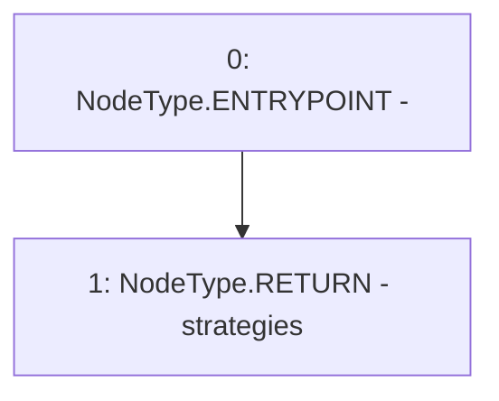

# Context: StrategyRegistry.getStrategies

**Contract:** `StrategyRegistry` (Inherits: IStrategyRegistry, OwnableUpgradeable, ContextUpgradeable, Initializable)
**Signature:** `getStrategies() returns (address[])`
**Method Selector ID:** `0xb49a60bb`
**Visibility:** `external`
**Environment-Free:** `Yes`
**Modifiers:** None

### State Variables Interaction
- **Reads:** strategies
- **Writes:** None

### Environment & Verification Flags
- **Uses Foundry Cheatcodes:** No
- **Has Echidna Properties:** No

### Internal Calls Tree
- None

### External Calls / Value Transfers
- None

### Control Flow Graph (CFG)


### Source Mapping
Declared in: `contracts/yield/StrategyRegistry.sol` on lines **60** to **62**

```solidity
    function getStrategies() external view override returns (address[] memory) {
        return strategies;
    }

```
