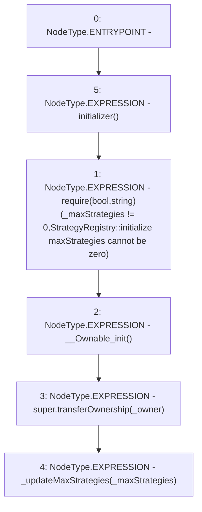

# Context: StrategyRegistry.initialize

**Contract:** `StrategyRegistry` (Inherits: IStrategyRegistry, OwnableUpgradeable, ContextUpgradeable, Initializable)
**Signature:** `initialize(address,uint256)`
**Method Selector ID:** `0xcd6dc687`
**Visibility:** `external`
**Environment-Free:** `No (reads EVM state context)`
**Modifiers:**
- `initializer`
  ```solidity
  modifier initializer() {
          require(_initializing || _isConstructor() || !_initialized, "Initializable: contract is already initialized");
  
          bool isTopLevelCall = !_initializing;
          if (isTopLevelCall) {
              _initializing = true;
              _initialized = true;
          }
  
          _;
  
          if (isTopLevelCall) {
              _initializing = false;
          }
      }
  ```

### State Variables Interaction
- **Reads:** None
- **Writes:** None

### Assertion Checks & Business Requirements
- require/assert: `require(bool,string)(_maxStrategies != 0,StrategyRegistry::initialize maxStrategies cannot be zero)`

### Environment & Verification Flags
- **Uses Foundry Cheatcodes:** No
- **Has Echidna Properties:** No

### Internal Calls Tree
- None

### External Calls / Value Transfers
- None

### Control Flow Graph (CFG)


### Source Mapping
Declared in: `contracts/yield/StrategyRegistry.sol` on lines **33** to **39**

```solidity
    function initialize(address _owner, uint256 _maxStrategies) external initializer {
        require(_maxStrategies != 0, 'StrategyRegistry::initialize maxStrategies cannot be zero');
        __Ownable_init();
        super.transferOwnership(_owner);

        _updateMaxStrategies(_maxStrategies);
    }

```
