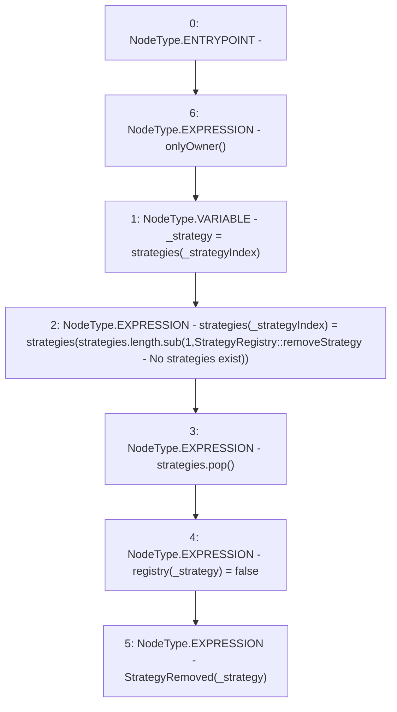

# Context: StrategyRegistry.removeStrategy

**Contract:** `StrategyRegistry` (Inherits: IStrategyRegistry, OwnableUpgradeable, ContextUpgradeable, Initializable)
**Signature:** `removeStrategy(uint256)`
**Method Selector ID:** `0xc0cbbca6`
**Visibility:** `external`
**Environment-Free:** `No (reads EVM state context)`
**Modifiers:**
- `onlyOwner`
  ```solidity
  modifier onlyOwner() {
          require(owner() == _msgSender(), "Ownable: caller is not the owner");
          _;
      }
  ```

### State Variables Interaction
- **Reads:** strategies
- **Writes:** registry, strategies

### Environment & Verification Flags
- **Uses Foundry Cheatcodes:** No
- **Has Echidna Properties:** No

### Internal Calls Tree
- None

### External Calls / Value Transfers
- `SafeMath.TMP_3888(uint256) = LIBRARY_CALL, dest:SafeMath, function:SafeMath.sub(uint256,uint256,string), arguments:['REF_1688', '1', 'StrategyRegistry::removeStrategy - No strategies exist'] `

### Control Flow Graph (CFG)


### Source Mapping
Declared in: `contracts/yield/StrategyRegistry.sol` on lines **82** to **89**

```solidity
    function removeStrategy(uint256 _strategyIndex) external override onlyOwner {
        address _strategy = strategies[_strategyIndex];
        strategies[_strategyIndex] = strategies[strategies.length.sub(1, 'StrategyRegistry::removeStrategy - No strategies exist')];
        strategies.pop();
        registry[_strategy] = false;

        emit StrategyRemoved(_strategy);
    }

```
