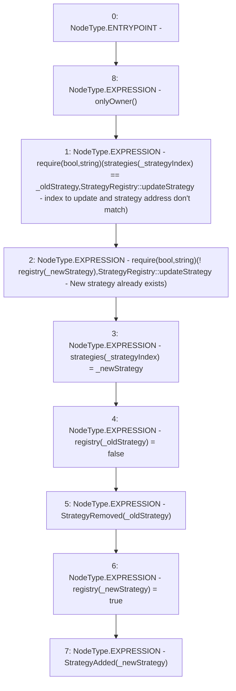

# Context: StrategyRegistry.updateStrategy

**Contract:** `StrategyRegistry` (Inherits: IStrategyRegistry, OwnableUpgradeable, ContextUpgradeable, Initializable)
**Signature:** `updateStrategy(uint256,address,address)`
**Method Selector ID:** `0x76ba717b`
**Visibility:** `external`
**Environment-Free:** `No (reads EVM state context)`
**Modifiers:**
- `onlyOwner`
  ```solidity
  modifier onlyOwner() {
          require(owner() == _msgSender(), "Ownable: caller is not the owner");
          _;
      }
  ```

### State Variables Interaction
- **Reads:** registry, strategies
- **Writes:** registry, strategies

### Assertion Checks & Business Requirements
- require/assert: `require(bool,string)(strategies[_strategyIndex] == _oldStrategy,StrategyRegistry::updateStrategy - index to update and strategy address don't match)`
- require/assert: `require(bool,string)(! registry[_newStrategy],StrategyRegistry::updateStrategy - New strategy already exists)`

### Environment & Verification Flags
- **Uses Foundry Cheatcodes:** No
- **Has Echidna Properties:** No

### Internal Calls Tree
- None

### External Calls / Value Transfers
- None

### Control Flow Graph (CFG)


### Source Mapping
Declared in: `contracts/yield/StrategyRegistry.sol` on lines **97** to **113**

```solidity
    function updateStrategy(
        uint256 _strategyIndex,
        address _oldStrategy,
        address _newStrategy
    ) external override onlyOwner {
        require(
            strategies[_strategyIndex] == _oldStrategy,
            "StrategyRegistry::updateStrategy - index to update and strategy address don't match"
        );
        require(!registry[_newStrategy], 'StrategyRegistry::updateStrategy - New strategy already exists');
        strategies[_strategyIndex] = _newStrategy;

        registry[_oldStrategy] = false;
        emit StrategyRemoved(_oldStrategy);
        registry[_newStrategy] = true;
        emit StrategyAdded(_newStrategy);
    }

```
