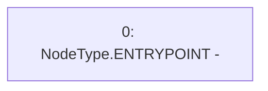

# Context: Strategy._approveAll

**Contract:** `Strategy` (Inherits: None)
**Signature:** `_approveAll()`
**Method Selector ID:** `Internal (No Method ID)`
**Visibility:** `internal`
**Environment-Free:** `Yes`
**Modifiers:** None

### State Variables Interaction
- **Reads:** None
- **Writes:** None

### Environment & Verification Flags
- **Uses Foundry Cheatcodes:** No
- **Has Echidna Properties:** No

### Internal Calls Tree
- None

### External Calls / Value Transfers
- None

### Control Flow Graph (CFG)


### Source Mapping
Declared in: `contracts/mocks/yVault/Strategy.sol` on lines **41** to **43**

```solidity
    function _approveAll() internal {
        // IERC20(token).approve(mcd_join_eth_a, uint256(-1));
    }

```
