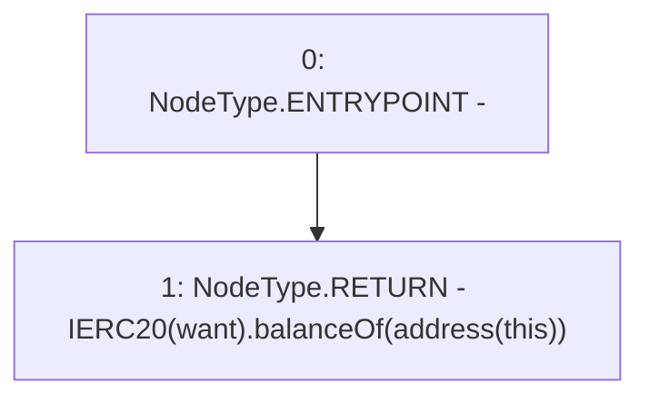

# Context: Strategy.balanceOf

**Contract:** `Strategy` (Inherits: None)
**Signature:** `balanceOf() returns (uint256)`
**Method Selector ID:** `0x722713f7`
**Visibility:** `public`
**Environment-Free:** `Yes`
**Modifiers:** None

### State Variables Interaction
- **Reads:** want
- **Writes:** None

### Environment & Verification Flags
- **Uses Foundry Cheatcodes:** No
- **Has Echidna Properties:** No

### Internal Calls Tree
- None

### External Calls / Value Transfers
- `IERC20.TMP_3106(uint256) = HIGH_LEVEL_CALL, dest:TMP_3104(IERC20), function:balanceOf, arguments:['TMP_3105']  `

### Control Flow Graph (CFG)


### Source Mapping
Declared in: `contracts/mocks/yVault/Strategy.sol` on lines **77** to **79**

```solidity
    function balanceOf() public view returns (uint256) {
        return IERC20(want).balanceOf(address(this));
    }

```
