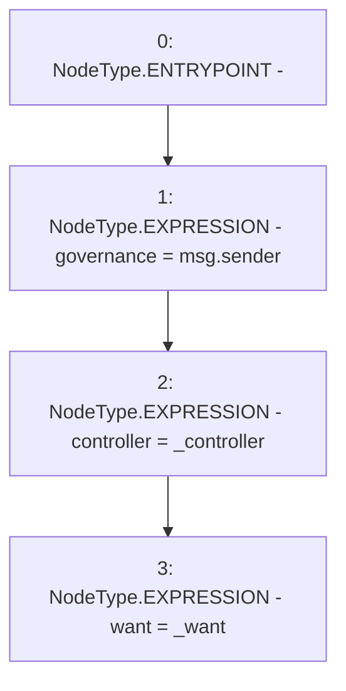

# Context: Strategy.constructor

**Contract:** `Strategy` (Inherits: None)
**Signature:** `constructor(address,address)`
**Method Selector ID:** `0x4525f804`
**Visibility:** `public`
**Environment-Free:** `No (reads EVM state context)`
**Modifiers:** None

### State Variables Interaction
- **Reads:** None
- **Writes:** controller, governance, want

### Environment & Verification Flags
- **Uses Foundry Cheatcodes:** No
- **Has Echidna Properties:** No

### Internal Calls Tree
- None

### External Calls / Value Transfers
- None

### Control Flow Graph (CFG)


### Source Mapping
Declared in: `contracts/mocks/yVault/Strategy.sol` on lines **35** to **39**

```solidity
    constructor(address _controller, address _want) {
        governance = msg.sender;
        controller = _controller;
        want = _want;
    }

```
