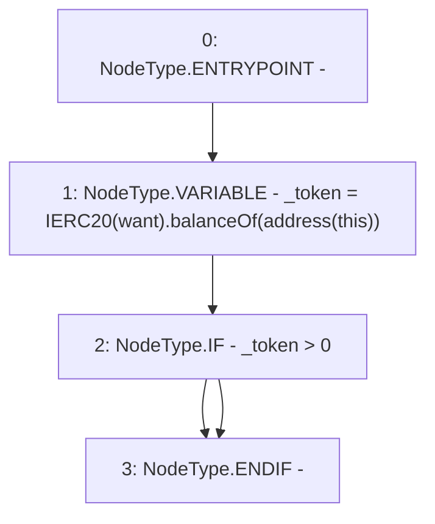

# Context: Strategy.deposit

**Contract:** `Strategy` (Inherits: None)
**Signature:** `deposit()`
**Method Selector ID:** `0xd0e30db0`
**Visibility:** `public`
**Environment-Free:** `Yes`
**Modifiers:** None

### State Variables Interaction
- **Reads:** want
- **Writes:** None

### Environment & Verification Flags
- **Uses Foundry Cheatcodes:** No
- **Has Echidna Properties:** No

### Internal Calls Tree
- None

### External Calls / Value Transfers
- `IERC20.TMP_3077(uint256) = HIGH_LEVEL_CALL, dest:TMP_3075(IERC20), function:balanceOf, arguments:['TMP_3076']  `

### Control Flow Graph (CFG)


### Source Mapping
Declared in: `contracts/mocks/yVault/Strategy.sol` on lines **45** to **51**

```solidity
    function deposit() public view {
        uint256 _token = IERC20(want).balanceOf(address(this));
        if (_token > 0) {
            // approve yVaultDAI use DAI
            // yVault(yVaultDAI).depositAll();
        }
    }

```
