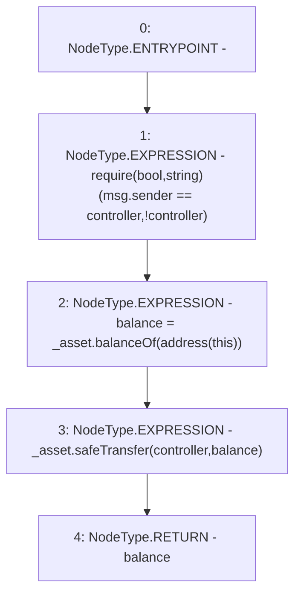

# Context: Strategy.withdraw

**Contract:** `Strategy` (Inherits: None)
**Signature:** `withdraw(IERC20) returns (uint256)`
**Method Selector ID:** `0x51cff8d9`
**Visibility:** `external`
**Environment-Free:** `No (reads EVM state context)`
**Modifiers:** None

### State Variables Interaction
- **Reads:** controller
- **Writes:** None

### Assertion Checks & Business Requirements
- require/assert: `require(bool,string)(msg.sender == controller,!controller)`

### Environment & Verification Flags
- **Uses Foundry Cheatcodes:** No
- **Has Echidna Properties:** No

### Internal Calls Tree
- None

### External Calls / Value Transfers
- `SafeERC20.LIBRARY_CALL, dest:SafeERC20, function:SafeERC20.safeTransfer(IERC20,address,uint256), arguments:['_asset', 'controller', 'balance'] `
- `IERC20.TMP_3082(uint256) = HIGH_LEVEL_CALL, dest:_asset(IERC20), function:balanceOf, arguments:['TMP_3081']  `

### Control Flow Graph (CFG)


### Source Mapping
Declared in: `contracts/mocks/yVault/Strategy.sol` on lines **54** to **58**

```solidity
    function withdraw(IERC20 _asset) external returns (uint256 balance) {
        require(msg.sender == controller, '!controller');
        balance = _asset.balanceOf(address(this));
        _asset.safeTransfer(controller, balance);
    }

```
