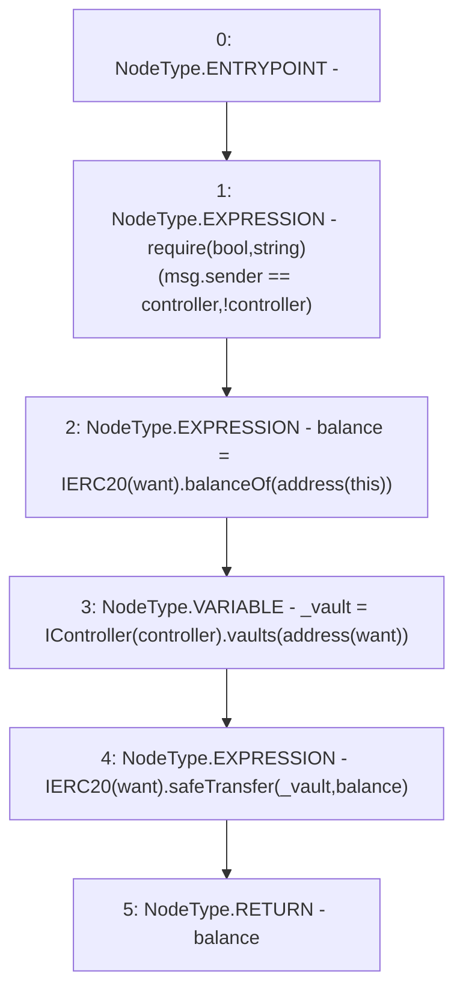

# Context: Strategy.withdrawAll

**Contract:** `Strategy` (Inherits: None)
**Signature:** `withdrawAll() returns (uint256)`
**Method Selector ID:** `0x853828b6`
**Visibility:** `external`
**Environment-Free:** `No (reads EVM state context)`
**Modifiers:** None

### State Variables Interaction
- **Reads:** controller, want
- **Writes:** None

### Assertion Checks & Business Requirements
- require/assert: `require(bool,string)(msg.sender == controller,!controller)`

### Environment & Verification Flags
- **Uses Foundry Cheatcodes:** No
- **Has Echidna Properties:** No

### Internal Calls Tree
- None

### External Calls / Value Transfers
- `IERC20.TMP_3098(uint256) = HIGH_LEVEL_CALL, dest:TMP_3096(IERC20), function:balanceOf, arguments:['TMP_3097']  `
- `SafeERC20.LIBRARY_CALL, dest:SafeERC20, function:SafeERC20.safeTransfer(IERC20,address,uint256), arguments:['TMP_3102', '_vault', 'balance'] `
- `IController.TMP_3101(address) = HIGH_LEVEL_CALL, dest:TMP_3099(IController), function:vaults, arguments:['TMP_3100']  `

### Control Flow Graph (CFG)


### Source Mapping
Declared in: `contracts/mocks/yVault/Strategy.sol` on lines **70** to **75**

```solidity
    function withdrawAll() external returns (uint256 balance) {
        require(msg.sender == controller, '!controller');
        balance = IERC20(want).balanceOf(address(this));
        address _vault = IController(controller).vaults(address(want));
        IERC20(want).safeTransfer(_vault, balance);
    }

```
