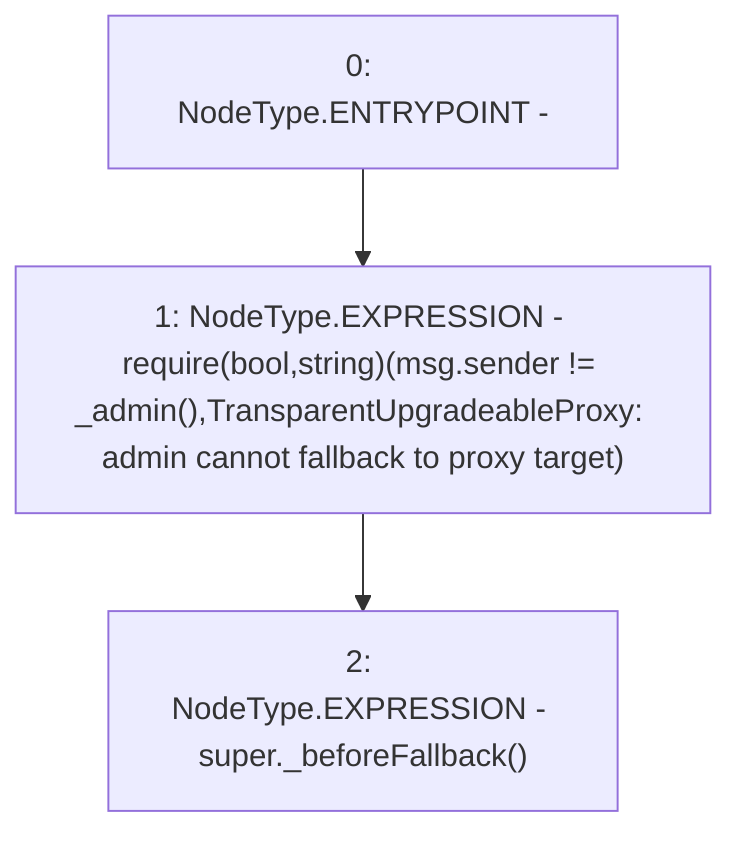

# Context: SublimeProxy._beforeFallback

**Contract:** `SublimeProxy` (Inherits: TransparentUpgradeableProxy, UpgradeableProxy, Proxy)
**Signature:** `_beforeFallback()`
**Method Selector ID:** `Internal (No Method ID)`
**Visibility:** `internal`
**Environment-Free:** `No (reads EVM state context)`
**Modifiers:** None

### State Variables Interaction
- **Reads:** None
- **Writes:** None

### Assertion Checks & Business Requirements
- require/assert: `require(bool,string)(msg.sender != _admin(),TransparentUpgradeableProxy: admin cannot fallback to proxy target)`

### Environment & Verification Flags
- **Uses Foundry Cheatcodes:** No
- **Has Echidna Properties:** No

### Internal Calls Tree
- None

### External Calls / Value Transfers
- None

### Control Flow Graph (CFG)


### Source Mapping
Declared in: `node_modules/@openzeppelin/contracts/proxy/TransparentUpgradeableProxy.sol` on lines **147** to **150**

```solidity
    function _beforeFallback() internal virtual override {
        require(msg.sender != _admin(), "TransparentUpgradeableProxy: admin cannot fallback to proxy target");
        super._beforeFallback();
    }

```
