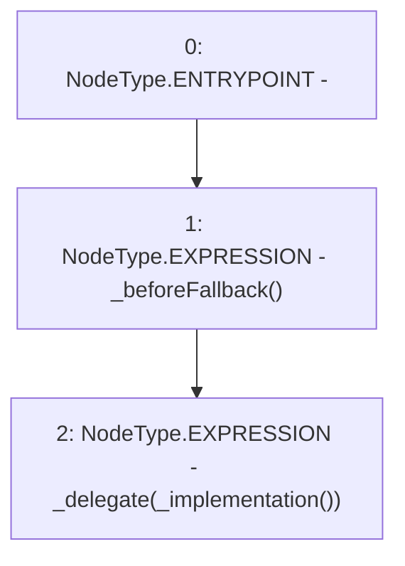

# Context: SublimeProxy._fallback

**Contract:** `SublimeProxy` (Inherits: TransparentUpgradeableProxy, UpgradeableProxy, Proxy)
**Signature:** `_fallback()`
**Method Selector ID:** `Internal (No Method ID)`
**Visibility:** `internal`
**Environment-Free:** `No (reads EVM state context)`
**Modifiers:** None

### State Variables Interaction
- **Reads:** None
- **Writes:** None

### Environment & Verification Flags
- **Uses Foundry Cheatcodes:** No
- **Has Echidna Properties:** No

### Internal Calls Tree
- None

### External Calls / Value Transfers
- None

### Control Flow Graph (CFG)


### Source Mapping
Declared in: `node_modules/@openzeppelin/contracts/proxy/Proxy.sol` on lines **54** to **57**

```solidity
    function _fallback() internal virtual {
        _beforeFallback();
        _delegate(_implementation());
    }

```
