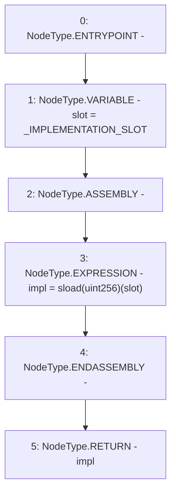

# Context: SublimeProxy._implementation

**Contract:** `SublimeProxy` (Inherits: TransparentUpgradeableProxy, UpgradeableProxy, Proxy)
**Signature:** `_implementation() returns (address)`
**Method Selector ID:** `Internal (No Method ID)`
**Visibility:** `internal`
**Environment-Free:** `Yes`
**Modifiers:** None

### State Variables Interaction
- **Reads:** _IMPLEMENTATION_SLOT
- **Writes:** None

### Environment & Verification Flags
- **Uses Foundry Cheatcodes:** No
- **Has Echidna Properties:** No

### Internal Calls Tree
- None

### External Calls / Value Transfers
- None

### Control Flow Graph (CFG)


### Source Mapping
Declared in: `node_modules/@openzeppelin/contracts/proxy/UpgradeableProxy.sol` on lines **47** to **53**

```solidity
    function _implementation() internal view virtual override returns (address impl) {
        bytes32 slot = _IMPLEMENTATION_SLOT;
        // solhint-disable-next-line no-inline-assembly
        assembly {
            impl := sload(slot)
        }
    }

```
