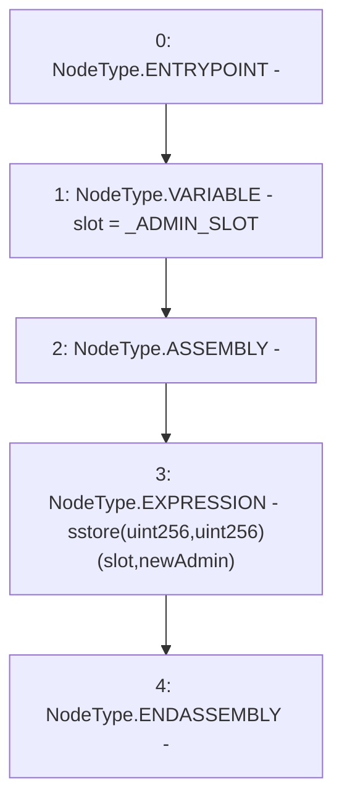

# Context: SublimeProxy._setAdmin

**Contract:** `SublimeProxy` (Inherits: TransparentUpgradeableProxy, UpgradeableProxy, Proxy)
**Signature:** `_setAdmin(address)`
**Method Selector ID:** `Internal (No Method ID)`
**Visibility:** `private`
**Environment-Free:** `Yes`
**Modifiers:** None

### State Variables Interaction
- **Reads:** _ADMIN_SLOT
- **Writes:** None

### Environment & Verification Flags
- **Uses Foundry Cheatcodes:** No
- **Has Echidna Properties:** No

### Internal Calls Tree
- None

### External Calls / Value Transfers
- None

### Control Flow Graph (CFG)


### Source Mapping
Declared in: `node_modules/@openzeppelin/contracts/proxy/TransparentUpgradeableProxy.sol` on lines **135** to **142**

```solidity
    function _setAdmin(address newAdmin) private {
        bytes32 slot = _ADMIN_SLOT;

        // solhint-disable-next-line no-inline-assembly
        assembly {
            sstore(slot, newAdmin)
        }
    }

```
