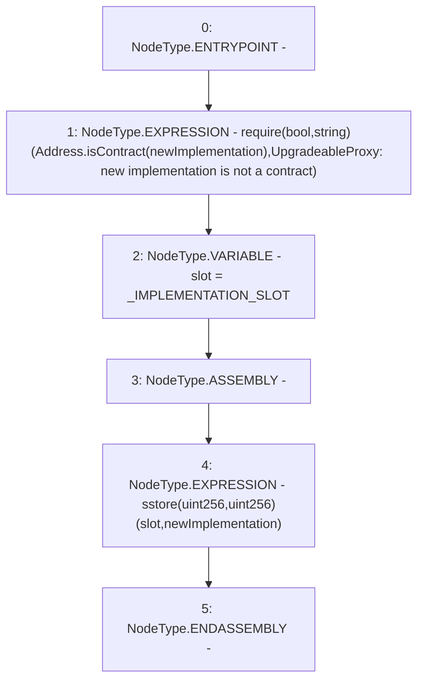

# Context: SublimeProxy._setImplementation

**Contract:** `SublimeProxy` (Inherits: TransparentUpgradeableProxy, UpgradeableProxy, Proxy)
**Signature:** `_setImplementation(address)`
**Method Selector ID:** `Internal (No Method ID)`
**Visibility:** `private`
**Environment-Free:** `Yes`
**Modifiers:** None

### State Variables Interaction
- **Reads:** _IMPLEMENTATION_SLOT
- **Writes:** None

### Assertion Checks & Business Requirements
- require/assert: `require(bool,string)(Address.isContract(newImplementation),UpgradeableProxy: new implementation is not a contract)`

### Environment & Verification Flags
- **Uses Foundry Cheatcodes:** No
- **Has Echidna Properties:** No

### Internal Calls Tree
- None

### External Calls / Value Transfers
- `Address.TMP_2491(bool) = LIBRARY_CALL, dest:Address, function:Address.isContract(address), arguments:['newImplementation'] `

### Control Flow Graph (CFG)


### Source Mapping
Declared in: `node_modules/@openzeppelin/contracts/proxy/UpgradeableProxy.sol` on lines **68** to **77**

```solidity
    function _setImplementation(address newImplementation) private {
        require(Address.isContract(newImplementation), "UpgradeableProxy: new implementation is not a contract");

        bytes32 slot = _IMPLEMENTATION_SLOT;

        // solhint-disable-next-line no-inline-assembly
        assembly {
            sstore(slot, newImplementation)
        }
    }

```
