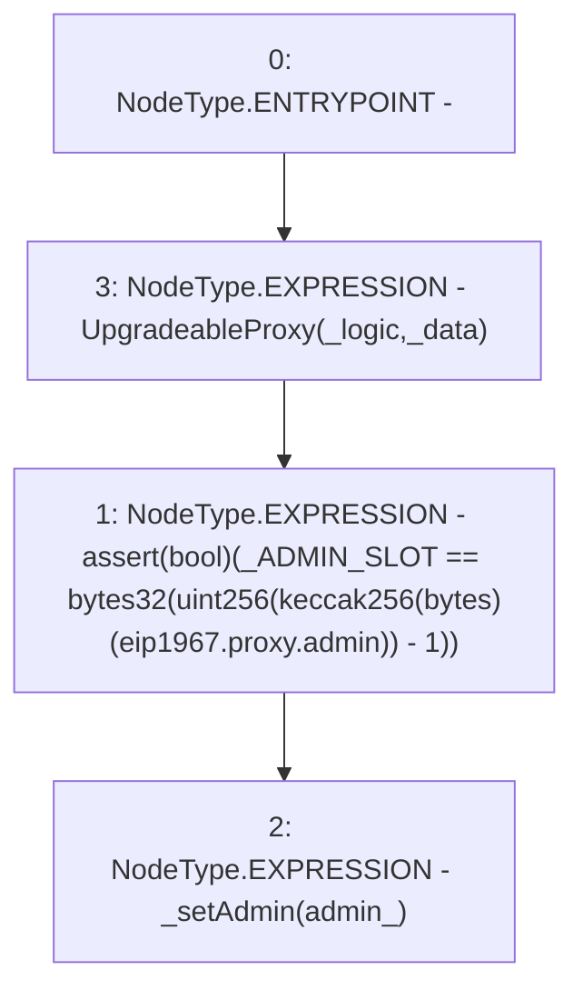

# Context: SublimeProxy.constructor

**Contract:** `SublimeProxy` (Inherits: TransparentUpgradeableProxy, UpgradeableProxy, Proxy)
**Signature:** `constructor(address,address,bytes)`
**Method Selector ID:** `0x0b5b630d`
**Visibility:** `public`
**Environment-Free:** `Yes`
**Modifiers:** None

### State Variables Interaction
- **Reads:** _ADMIN_SLOT
- **Writes:** None

### Assertion Checks & Business Requirements
- require/assert: `assert(bool)(_ADMIN_SLOT == bytes32(uint256(keccak256(bytes)(eip1967.proxy.admin)) - 1))`

### Environment & Verification Flags
- **Uses Foundry Cheatcodes:** No
- **Has Echidna Properties:** No

### Internal Calls Tree
- None

### External Calls / Value Transfers
- None

### Control Flow Graph (CFG)


### Source Mapping
Declared in: `node_modules/@openzeppelin/contracts/proxy/TransparentUpgradeableProxy.sol` on lines **33** to **36**

```solidity
    constructor(address _logic, address admin_, bytes memory _data) public payable UpgradeableProxy(_logic, _data) {
        assert(_ADMIN_SLOT == bytes32(uint256(keccak256("eip1967.proxy.admin")) - 1));
        _setAdmin(admin_);
    }

```
