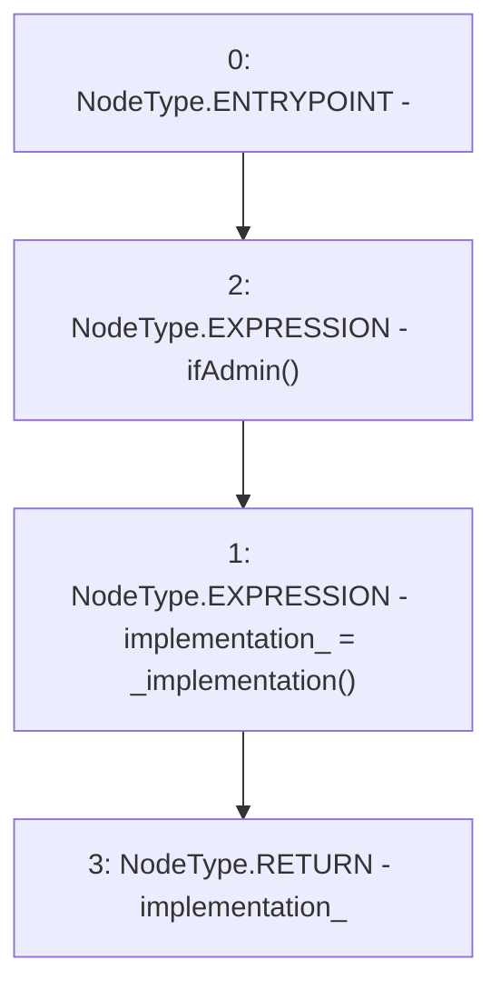

# Context: SublimeProxy.implementation

**Contract:** `SublimeProxy` (Inherits: TransparentUpgradeableProxy, UpgradeableProxy, Proxy)
**Signature:** `implementation() returns (address)`
**Method Selector ID:** `0x5c60da1b`
**Visibility:** `external`
**Environment-Free:** `No (reads EVM state context)`
**Modifiers:**
- `ifAdmin`
  ```solidity
  modifier ifAdmin() {
          if (msg.sender == _admin()) {
              _;
          } else {
              _fallback();
          }
      }
  ```

### State Variables Interaction
- **Reads:** None
- **Writes:** None

### Environment & Verification Flags
- **Uses Foundry Cheatcodes:** No
- **Has Echidna Properties:** No

### Internal Calls Tree
- None

### External Calls / Value Transfers
- None

### Control Flow Graph (CFG)


### Source Mapping
Declared in: `node_modules/@openzeppelin/contracts/proxy/TransparentUpgradeableProxy.sol` on lines **83** to **85**

```solidity
    function implementation() external ifAdmin returns (address implementation_) {
        implementation_ = _implementation();
    }

```
