# Context: TickMath.getSqrtRatioAtTick

**Contract:** `TickMath` (Inherits: None)
**Signature:** `getSqrtRatioAtTick(int24) returns (uint160)`
**Method Selector ID:** `Internal (No Method ID)`
**Visibility:** `internal`
**Environment-Free:** `Yes`
**Modifiers:** None

### State Variables Interaction
- **Reads:** MAX_TICK
- **Writes:** None

### Assertion Checks & Business Requirements
- require/assert: `require(bool,string)(absTick <= uint256(MAX_TICK),T)`

### Environment & Verification Flags
- **Uses Foundry Cheatcodes:** No
- **Has Echidna Properties:** No

### Internal Calls Tree
- None

### External Calls / Value Transfers
- None

### Control Flow Graph (CFG)

```mermaid
flowchart TD
    Node_0["0: NodeType.ENTRYPOINT - "]
    Node_0 --> Node_65
    Node_2["2: NodeType.EXPRESSION - require(bool,string)(absTick <= uint256(MAX_TICK),T)"]
    Node_2 --> Node_69
    Node_4["4: NodeType.IF - absTick & 0x2 != 0"]
    Node_4 --> Node_5
    Node_4 --> Node_6
    Node_5["5: NodeType.EXPRESSION - ratio = (ratio * 0xfff97272373d413259a46990580e213a) >> 128"]
    Node_5 --> Node_6
    Node_6["6: NodeType.ENDIF - "]
    Node_6 --> Node_7
    Node_7["7: NodeType.IF - absTick & 0x4 != 0"]
    Node_7 --> Node_8
    Node_7 --> Node_9
    Node_8["8: NodeType.EXPRESSION - ratio = (ratio * 0xfff2e50f5f656932ef12357cf3c7fdcc) >> 128"]
    Node_8 --> Node_9
    Node_9["9: NodeType.ENDIF - "]
    Node_9 --> Node_10
    Node_10["10: NodeType.IF - absTick & 0x8 != 0"]
    Node_10 --> Node_11
    Node_10 --> Node_12
    Node_11["11: NodeType.EXPRESSION - ratio = (ratio * 0xffe5caca7e10e4e61c3624eaa0941cd0) >> 128"]
    Node_11 --> Node_12
    Node_12["12: NodeType.ENDIF - "]
    Node_12 --> Node_13
    Node_13["13: NodeType.IF - absTick & 0x10 != 0"]
    Node_13 --> Node_14
    Node_13 --> Node_15
    Node_14["14: NodeType.EXPRESSION - ratio = (ratio * 0xffcb9843d60f6159c9db58835c926644) >> 128"]
    Node_14 --> Node_15
    Node_15["15: NodeType.ENDIF - "]
    Node_15 --> Node_16
    Node_16["16: NodeType.IF - absTick & 0x20 != 0"]
    Node_16 --> Node_17
    Node_16 --> Node_18
    Node_17["17: NodeType.EXPRESSION - ratio = (ratio * 0xff973b41fa98c081472e6896dfb254c0) >> 128"]
    Node_17 --> Node_18
    Node_18["18: NodeType.ENDIF - "]
    Node_18 --> Node_19
    Node_19["19: NodeType.IF - absTick & 0x40 != 0"]
    Node_19 --> Node_20
    Node_19 --> Node_21
    Node_20["20: NodeType.EXPRESSION - ratio = (ratio * 0xff2ea16466c96a3843ec78b326b52861) >> 128"]
    Node_20 --> Node_21
    Node_21["21: NodeType.ENDIF - "]
    Node_21 --> Node_22
    Node_22["22: NodeType.IF - absTick & 0x80 != 0"]
    Node_22 --> Node_23
    Node_22 --> Node_24
    Node_23["23: NodeType.EXPRESSION - ratio = (ratio * 0xfe5dee046a99a2a811c461f1969c3053) >> 128"]
    Node_23 --> Node_24
    Node_24["24: NodeType.ENDIF - "]
    Node_24 --> Node_25
    Node_25["25: NodeType.IF - absTick & 0x100 != 0"]
    Node_25 --> Node_26
    Node_25 --> Node_27
    Node_26["26: NodeType.EXPRESSION - ratio = (ratio * 0xfcbe86c7900a88aedcffc83b479aa3a4) >> 128"]
    Node_26 --> Node_27
    Node_27["27: NodeType.ENDIF - "]
    Node_27 --> Node_28
    Node_28["28: NodeType.IF - absTick & 0x200 != 0"]
    Node_28 --> Node_29
    Node_28 --> Node_30
    Node_29["29: NodeType.EXPRESSION - ratio = (ratio * 0xf987a7253ac413176f2b074cf7815e54) >> 128"]
    Node_29 --> Node_30
    Node_30["30: NodeType.ENDIF - "]
    Node_30 --> Node_31
    Node_31["31: NodeType.IF - absTick & 0x400 != 0"]
    Node_31 --> Node_32
    Node_31 --> Node_33
    Node_32["32: NodeType.EXPRESSION - ratio = (ratio * 0xf3392b0822b70005940c7a398e4b70f3) >> 128"]
    Node_32 --> Node_33
    Node_33["33: NodeType.ENDIF - "]
    Node_33 --> Node_34
    Node_34["34: NodeType.IF - absTick & 0x800 != 0"]
    Node_34 --> Node_35
    Node_34 --> Node_36
    Node_35["35: NodeType.EXPRESSION - ratio = (ratio * 0xe7159475a2c29b7443b29c7fa6e889d9) >> 128"]
    Node_35 --> Node_36
    Node_36["36: NodeType.ENDIF - "]
    Node_36 --> Node_37
    Node_37["37: NodeType.IF - absTick & 0x1000 != 0"]
    Node_37 --> Node_38
    Node_37 --> Node_39
    Node_38["38: NodeType.EXPRESSION - ratio = (ratio * 0xd097f3bdfd2022b8845ad8f792aa5825) >> 128"]
    Node_38 --> Node_39
    Node_39["39: NodeType.ENDIF - "]
    Node_39 --> Node_40
    Node_40["40: NodeType.IF - absTick & 0x2000 != 0"]
    Node_40 --> Node_41
    Node_40 --> Node_42
    Node_41["41: NodeType.EXPRESSION - ratio = (ratio * 0xa9f746462d870fdf8a65dc1f90e061e5) >> 128"]
    Node_41 --> Node_42
    Node_42["42: NodeType.ENDIF - "]
    Node_42 --> Node_43
    Node_43["43: NodeType.IF - absTick & 0x4000 != 0"]
    Node_43 --> Node_44
    Node_43 --> Node_45
    Node_44["44: NodeType.EXPRESSION - ratio = (ratio * 0x70d869a156d2a1b890bb3df62baf32f7) >> 128"]
    Node_44 --> Node_45
    Node_45["45: NodeType.ENDIF - "]
    Node_45 --> Node_46
    Node_46["46: NodeType.IF - absTick & 0x8000 != 0"]
    Node_46 --> Node_47
    Node_46 --> Node_48
    Node_47["47: NodeType.EXPRESSION - ratio = (ratio * 0x31be135f97d08fd981231505542fcfa6) >> 128"]
    Node_47 --> Node_48
    Node_48["48: NodeType.ENDIF - "]
    Node_48 --> Node_49
    Node_49["49: NodeType.IF - absTick & 0x10000 != 0"]
    Node_49 --> Node_50
    Node_49 --> Node_51
    Node_50["50: NodeType.EXPRESSION - ratio = (ratio * 0x9aa508b5b7a84e1c677de54f3e99bc9) >> 128"]
    Node_50 --> Node_51
    Node_51["51: NodeType.ENDIF - "]
    Node_51 --> Node_52
    Node_52["52: NodeType.IF - absTick & 0x20000 != 0"]
    Node_52 --> Node_53
    Node_52 --> Node_54
    Node_53["53: NodeType.EXPRESSION - ratio = (ratio * 0x5d6af8dedb81196699c329225ee604) >> 128"]
    Node_53 --> Node_54
    Node_54["54: NodeType.ENDIF - "]
    Node_54 --> Node_55
    Node_55["55: NodeType.IF - absTick & 0x40000 != 0"]
    Node_55 --> Node_56
    Node_55 --> Node_57
    Node_56["56: NodeType.EXPRESSION - ratio = (ratio * 0x2216e584f5fa1ea926041bedfe98) >> 128"]
    Node_56 --> Node_57
    Node_57["57: NodeType.ENDIF - "]
    Node_57 --> Node_58
    Node_58["58: NodeType.IF - absTick & 0x80000 != 0"]
    Node_58 --> Node_59
    Node_58 --> Node_60
    Node_59["59: NodeType.EXPRESSION - ratio = (ratio * 0x48a170391f7dc42444e8fa2) >> 128"]
    Node_59 --> Node_60
    Node_60["60: NodeType.ENDIF - "]
    Node_60 --> Node_61
    Node_61["61: NodeType.IF - tick > 0"]
    Node_61 --> Node_62
    Node_61 --> Node_63
    Node_62["62: NodeType.EXPRESSION - ratio = type()(uint256).max / ratio"]
    Node_62 --> Node_63
    Node_63["63: NodeType.ENDIF - "]
    Node_63 --> Node_73
    Node_65["65: NodeType.IF - tick < 0"]
    Node_65 --> Node_66
    Node_65 --> Node_67
    Node_66["66: NodeType.EXPRESSION - absTick = uint256(- int256(tick))"]
    Node_66 --> Node_68
    Node_67["67: NodeType.EXPRESSION - absTick = uint256(int256(tick))"]
    Node_67 --> Node_68
    Node_68["68: NodeType.ENDIF - "]
    Node_68 --> Node_2
    Node_69["69: NodeType.IF - absTick & 0x1 != 0"]
    Node_69 --> Node_70
    Node_69 --> Node_71
    Node_70["70: NodeType.EXPRESSION - ratio = 0xfffcb933bd6fad37aa2d162d1a594001"]
    Node_70 --> Node_72
    Node_71["71: NodeType.EXPRESSION - ratio = 0x100000000000000000000000000000000"]
    Node_71 --> Node_72
    Node_72["72: NodeType.ENDIF - "]
    Node_72 --> Node_4
    Node_73["73: NodeType.IF - ratio % (1 << 32) == 0"]
    Node_73 --> Node_74
    Node_73 --> Node_75
    Node_74["74: NodeType.EXPRESSION - sqrtPriceX96 = uint160((ratio >> 32) + 0)"]
    Node_74 --> Node_76
    Node_75["75: NodeType.EXPRESSION - sqrtPriceX96 = uint160((ratio >> 32) + 1)"]
    Node_75 --> Node_76
    Node_76["76: NodeType.ENDIF - "]
    Node_76 --> Node_77
    Node_77["77: NodeType.RETURN - sqrtPriceX96"]
```


### Source Mapping
Declared in: `node_modules/@uniswap/v3-core/contracts/libraries/TickMath.sol` on lines **23** to **54**

```solidity
    function getSqrtRatioAtTick(int24 tick) internal pure returns (uint160 sqrtPriceX96) {
        uint256 absTick = tick < 0 ? uint256(-int256(tick)) : uint256(int256(tick));
        require(absTick <= uint256(MAX_TICK), 'T');

        uint256 ratio = absTick & 0x1 != 0 ? 0xfffcb933bd6fad37aa2d162d1a594001 : 0x100000000000000000000000000000000;
        if (absTick & 0x2 != 0) ratio = (ratio * 0xfff97272373d413259a46990580e213a) >> 128;
        if (absTick & 0x4 != 0) ratio = (ratio * 0xfff2e50f5f656932ef12357cf3c7fdcc) >> 128;
        if (absTick & 0x8 != 0) ratio = (ratio * 0xffe5caca7e10e4e61c3624eaa0941cd0) >> 128;
        if (absTick & 0x10 != 0) ratio = (ratio * 0xffcb9843d60f6159c9db58835c926644) >> 128;
        if (absTick & 0x20 != 0) ratio = (ratio * 0xff973b41fa98c081472e6896dfb254c0) >> 128;
        if (absTick & 0x40 != 0) ratio = (ratio * 0xff2ea16466c96a3843ec78b326b52861) >> 128;
        if (absTick & 0x80 != 0) ratio = (ratio * 0xfe5dee046a99a2a811c461f1969c3053) >> 128;
        if (absTick & 0x100 != 0) ratio = (ratio * 0xfcbe86c7900a88aedcffc83b479aa3a4) >> 128;
        if (absTick & 0x200 != 0) ratio = (ratio * 0xf987a7253ac413176f2b074cf7815e54) >> 128;
        if (absTick & 0x400 != 0) ratio = (ratio * 0xf3392b0822b70005940c7a398e4b70f3) >> 128;
        if (absTick & 0x800 != 0) ratio = (ratio * 0xe7159475a2c29b7443b29c7fa6e889d9) >> 128;
        if (absTick & 0x1000 != 0) ratio = (ratio * 0xd097f3bdfd2022b8845ad8f792aa5825) >> 128;
        if (absTick & 0x2000 != 0) ratio = (ratio * 0xa9f746462d870fdf8a65dc1f90e061e5) >> 128;
        if (absTick & 0x4000 != 0) ratio = (ratio * 0x70d869a156d2a1b890bb3df62baf32f7) >> 128;
        if (absTick & 0x8000 != 0) ratio = (ratio * 0x31be135f97d08fd981231505542fcfa6) >> 128;
        if (absTick & 0x10000 != 0) ratio = (ratio * 0x9aa508b5b7a84e1c677de54f3e99bc9) >> 128;
        if (absTick & 0x20000 != 0) ratio = (ratio * 0x5d6af8dedb81196699c329225ee604) >> 128;
        if (absTick & 0x40000 != 0) ratio = (ratio * 0x2216e584f5fa1ea926041bedfe98) >> 128;
        if (absTick & 0x80000 != 0) ratio = (ratio * 0x48a170391f7dc42444e8fa2) >> 128;

        if (tick > 0) ratio = type(uint256).max / ratio;

        // this divides by 1<<32 rounding up to go from a Q128.128 to a Q128.96.
        // we then downcast because we know the result always fits within 160 bits due to our tick input constraint
        // we round up in the division so getTickAtSqrtRatio of the output price is always consistent
        sqrtPriceX96 = uint160((ratio >> 32) + (ratio % (1 << 32) == 0 ? 0 : 1));
    }

```
