# Context: TickMath.getTickAtSqrtRatio

**Contract:** `TickMath` (Inherits: None)
**Signature:** `getTickAtSqrtRatio(uint160) returns (int24)`
**Method Selector ID:** `Internal (No Method ID)`
**Visibility:** `internal`
**Environment-Free:** `Yes`
**Modifiers:** None

### State Variables Interaction
- **Reads:** MAX_SQRT_RATIO, MIN_SQRT_RATIO
- **Writes:** None

### Assertion Checks & Business Requirements
- require/assert: `require(bool,string)(sqrtPriceX96 >= MIN_SQRT_RATIO && sqrtPriceX96 < MAX_SQRT_RATIO,R)`

### Environment & Verification Flags
- **Uses Foundry Cheatcodes:** No
- **Has Echidna Properties:** No

### Internal Calls Tree
- None

### External Calls / Value Transfers
- None

### Control Flow Graph (CFG)

```mermaid
flowchart TD
    Node_0["0: NodeType.ENTRYPOINT - "]
    Node_0 --> Node_1
    Node_1["1: NodeType.EXPRESSION - require(bool,string)(sqrtPriceX96 >= MIN_SQRT_RATIO && sqrtPriceX96 < MAX_SQRT_RATIO,R)"]
    Node_1 --> Node_2
    Node_2["2: NodeType.VARIABLE - ratio = uint256(sqrtPriceX96) << 32"]
    Node_2 --> Node_3
    Node_3["3: NodeType.VARIABLE - r = ratio"]
    Node_3 --> Node_4
    Node_4["4: NodeType.VARIABLE - msb = 0"]
    Node_4 --> Node_5
    Node_5["5: NodeType.ASSEMBLY - "]
    Node_5 --> Node_6
    Node_6["6: NodeType.VARIABLE - "]
    Node_6 --> Node_7
    Node_7["7: NodeType.EXPRESSION - f_getTickAtSqrtRatio_asm_0 = r > 0xFFFFFFFFFFFFFFFFFFFFFFFFFFFFFFFF << 7"]
    Node_7 --> Node_8
    Node_8["8: NodeType.EXPRESSION - msb = msb | f_getTickAtSqrtRatio_asm_0"]
    Node_8 --> Node_9
    Node_9["9: NodeType.EXPRESSION - r = r >> f_getTickAtSqrtRatio_asm_0"]
    Node_9 --> Node_10
    Node_10["10: NodeType.ENDASSEMBLY - "]
    Node_10 --> Node_11
    Node_11["11: NodeType.ASSEMBLY - "]
    Node_11 --> Node_12
    Node_12["12: NodeType.VARIABLE - "]
    Node_12 --> Node_13
    Node_13["13: NodeType.EXPRESSION - f_getTickAtSqrtRatio_asm_1 = r > 0xFFFFFFFFFFFFFFFF << 6"]
    Node_13 --> Node_14
    Node_14["14: NodeType.EXPRESSION - msb = msb | f_getTickAtSqrtRatio_asm_1"]
    Node_14 --> Node_15
    Node_15["15: NodeType.EXPRESSION - r = r >> f_getTickAtSqrtRatio_asm_1"]
    Node_15 --> Node_16
    Node_16["16: NodeType.ENDASSEMBLY - "]
    Node_16 --> Node_17
    Node_17["17: NodeType.ASSEMBLY - "]
    Node_17 --> Node_18
    Node_18["18: NodeType.VARIABLE - "]
    Node_18 --> Node_19
    Node_19["19: NodeType.EXPRESSION - f_getTickAtSqrtRatio_asm_2 = r > 0xFFFFFFFF << 5"]
    Node_19 --> Node_20
    Node_20["20: NodeType.EXPRESSION - msb = msb | f_getTickAtSqrtRatio_asm_2"]
    Node_20 --> Node_21
    Node_21["21: NodeType.EXPRESSION - r = r >> f_getTickAtSqrtRatio_asm_2"]
    Node_21 --> Node_22
    Node_22["22: NodeType.ENDASSEMBLY - "]
    Node_22 --> Node_23
    Node_23["23: NodeType.ASSEMBLY - "]
    Node_23 --> Node_24
    Node_24["24: NodeType.VARIABLE - "]
    Node_24 --> Node_25
    Node_25["25: NodeType.EXPRESSION - f_getTickAtSqrtRatio_asm_3 = r > 0xFFFF << 4"]
    Node_25 --> Node_26
    Node_26["26: NodeType.EXPRESSION - msb = msb | f_getTickAtSqrtRatio_asm_3"]
    Node_26 --> Node_27
    Node_27["27: NodeType.EXPRESSION - r = r >> f_getTickAtSqrtRatio_asm_3"]
    Node_27 --> Node_28
    Node_28["28: NodeType.ENDASSEMBLY - "]
    Node_28 --> Node_29
    Node_29["29: NodeType.ASSEMBLY - "]
    Node_29 --> Node_30
    Node_30["30: NodeType.VARIABLE - "]
    Node_30 --> Node_31
    Node_31["31: NodeType.EXPRESSION - f_getTickAtSqrtRatio_asm_4 = r > 0xFF << 3"]
    Node_31 --> Node_32
    Node_32["32: NodeType.EXPRESSION - msb = msb | f_getTickAtSqrtRatio_asm_4"]
    Node_32 --> Node_33
    Node_33["33: NodeType.EXPRESSION - r = r >> f_getTickAtSqrtRatio_asm_4"]
    Node_33 --> Node_34
    Node_34["34: NodeType.ENDASSEMBLY - "]
    Node_34 --> Node_35
    Node_35["35: NodeType.ASSEMBLY - "]
    Node_35 --> Node_36
    Node_36["36: NodeType.VARIABLE - "]
    Node_36 --> Node_37
    Node_37["37: NodeType.EXPRESSION - f_getTickAtSqrtRatio_asm_5 = r > 0xF << 2"]
    Node_37 --> Node_38
    Node_38["38: NodeType.EXPRESSION - msb = msb | f_getTickAtSqrtRatio_asm_5"]
    Node_38 --> Node_39
    Node_39["39: NodeType.EXPRESSION - r = r >> f_getTickAtSqrtRatio_asm_5"]
    Node_39 --> Node_40
    Node_40["40: NodeType.ENDASSEMBLY - "]
    Node_40 --> Node_41
    Node_41["41: NodeType.ASSEMBLY - "]
    Node_41 --> Node_42
    Node_42["42: NodeType.VARIABLE - "]
    Node_42 --> Node_43
    Node_43["43: NodeType.EXPRESSION - f_getTickAtSqrtRatio_asm_6 = r > 0x3 << 1"]
    Node_43 --> Node_44
    Node_44["44: NodeType.EXPRESSION - msb = msb | f_getTickAtSqrtRatio_asm_6"]
    Node_44 --> Node_45
    Node_45["45: NodeType.EXPRESSION - r = r >> f_getTickAtSqrtRatio_asm_6"]
    Node_45 --> Node_46
    Node_46["46: NodeType.ENDASSEMBLY - "]
    Node_46 --> Node_47
    Node_47["47: NodeType.ASSEMBLY - "]
    Node_47 --> Node_48
    Node_48["48: NodeType.VARIABLE - "]
    Node_48 --> Node_49
    Node_49["49: NodeType.EXPRESSION - f_getTickAtSqrtRatio_asm_7 = r > 0x1"]
    Node_49 --> Node_50
    Node_50["50: NodeType.EXPRESSION - msb = msb | f_getTickAtSqrtRatio_asm_7"]
    Node_50 --> Node_51
    Node_51["51: NodeType.ENDASSEMBLY - "]
    Node_51 --> Node_52
    Node_52["52: NodeType.IF - msb >= 128"]
    Node_52 --> Node_53
    Node_52 --> Node_54
    Node_53["53: NodeType.EXPRESSION - r = ratio >> (msb - 127)"]
    Node_53 --> Node_55
    Node_54["54: NodeType.EXPRESSION - r = ratio << (127 - msb)"]
    Node_54 --> Node_55
    Node_55["55: NodeType.ENDIF - "]
    Node_55 --> Node_56
    Node_56["56: NodeType.VARIABLE - log_2 = (int256(msb) - 128) << 64"]
    Node_56 --> Node_57
    Node_57["57: NodeType.ASSEMBLY - "]
    Node_57 --> Node_58
    Node_58["58: NodeType.EXPRESSION - r = r * r >> 127"]
    Node_58 --> Node_59
    Node_59["59: NodeType.VARIABLE - "]
    Node_59 --> Node_60
    Node_60["60: NodeType.EXPRESSION - f_getTickAtSqrtRatio_asm_8 = r >> 128"]
    Node_60 --> Node_61
    Node_61["61: NodeType.EXPRESSION - log_2 = log_2 | f_getTickAtSqrtRatio_asm_8 << 63"]
    Node_61 --> Node_62
    Node_62["62: NodeType.EXPRESSION - r = r >> f_getTickAtSqrtRatio_asm_8"]
    Node_62 --> Node_63
    Node_63["63: NodeType.ENDASSEMBLY - "]
    Node_63 --> Node_64
    Node_64["64: NodeType.ASSEMBLY - "]
    Node_64 --> Node_65
    Node_65["65: NodeType.EXPRESSION - r = r * r >> 127"]
    Node_65 --> Node_66
    Node_66["66: NodeType.VARIABLE - "]
    Node_66 --> Node_67
    Node_67["67: NodeType.EXPRESSION - f_getTickAtSqrtRatio_asm_9 = r >> 128"]
    Node_67 --> Node_68
    Node_68["68: NodeType.EXPRESSION - log_2 = log_2 | f_getTickAtSqrtRatio_asm_9 << 62"]
    Node_68 --> Node_69
    Node_69["69: NodeType.EXPRESSION - r = r >> f_getTickAtSqrtRatio_asm_9"]
    Node_69 --> Node_70
    Node_70["70: NodeType.ENDASSEMBLY - "]
    Node_70 --> Node_71
    Node_71["71: NodeType.ASSEMBLY - "]
    Node_71 --> Node_72
    Node_72["72: NodeType.EXPRESSION - r = r * r >> 127"]
    Node_72 --> Node_73
    Node_73["73: NodeType.VARIABLE - "]
    Node_73 --> Node_74
    Node_74["74: NodeType.EXPRESSION - f_getTickAtSqrtRatio_asm_10 = r >> 128"]
    Node_74 --> Node_75
    Node_75["75: NodeType.EXPRESSION - log_2 = log_2 | f_getTickAtSqrtRatio_asm_10 << 61"]
    Node_75 --> Node_76
    Node_76["76: NodeType.EXPRESSION - r = r >> f_getTickAtSqrtRatio_asm_10"]
    Node_76 --> Node_77
    Node_77["77: NodeType.ENDASSEMBLY - "]
    Node_77 --> Node_78
    Node_78["78: NodeType.ASSEMBLY - "]
    Node_78 --> Node_79
    Node_79["79: NodeType.EXPRESSION - r = r * r >> 127"]
    Node_79 --> Node_80
    Node_80["80: NodeType.VARIABLE - "]
    Node_80 --> Node_81
    Node_81["81: NodeType.EXPRESSION - f_getTickAtSqrtRatio_asm_11 = r >> 128"]
    Node_81 --> Node_82
    Node_82["82: NodeType.EXPRESSION - log_2 = log_2 | f_getTickAtSqrtRatio_asm_11 << 60"]
    Node_82 --> Node_83
    Node_83["83: NodeType.EXPRESSION - r = r >> f_getTickAtSqrtRatio_asm_11"]
    Node_83 --> Node_84
    Node_84["84: NodeType.ENDASSEMBLY - "]
    Node_84 --> Node_85
    Node_85["85: NodeType.ASSEMBLY - "]
    Node_85 --> Node_86
    Node_86["86: NodeType.EXPRESSION - r = r * r >> 127"]
    Node_86 --> Node_87
    Node_87["87: NodeType.VARIABLE - "]
    Node_87 --> Node_88
    Node_88["88: NodeType.EXPRESSION - f_getTickAtSqrtRatio_asm_12 = r >> 128"]
    Node_88 --> Node_89
    Node_89["89: NodeType.EXPRESSION - log_2 = log_2 | f_getTickAtSqrtRatio_asm_12 << 59"]
    Node_89 --> Node_90
    Node_90["90: NodeType.EXPRESSION - r = r >> f_getTickAtSqrtRatio_asm_12"]
    Node_90 --> Node_91
    Node_91["91: NodeType.ENDASSEMBLY - "]
    Node_91 --> Node_92
    Node_92["92: NodeType.ASSEMBLY - "]
    Node_92 --> Node_93
    Node_93["93: NodeType.EXPRESSION - r = r * r >> 127"]
    Node_93 --> Node_94
    Node_94["94: NodeType.VARIABLE - "]
    Node_94 --> Node_95
    Node_95["95: NodeType.EXPRESSION - f_getTickAtSqrtRatio_asm_13 = r >> 128"]
    Node_95 --> Node_96
    Node_96["96: NodeType.EXPRESSION - log_2 = log_2 | f_getTickAtSqrtRatio_asm_13 << 58"]
    Node_96 --> Node_97
    Node_97["97: NodeType.EXPRESSION - r = r >> f_getTickAtSqrtRatio_asm_13"]
    Node_97 --> Node_98
    Node_98["98: NodeType.ENDASSEMBLY - "]
    Node_98 --> Node_99
    Node_99["99: NodeType.ASSEMBLY - "]
    Node_99 --> Node_100
    Node_100["100: NodeType.EXPRESSION - r = r * r >> 127"]
    Node_100 --> Node_101
    Node_101["101: NodeType.VARIABLE - "]
    Node_101 --> Node_102
    Node_102["102: NodeType.EXPRESSION - f_getTickAtSqrtRatio_asm_14 = r >> 128"]
    Node_102 --> Node_103
    Node_103["103: NodeType.EXPRESSION - log_2 = log_2 | f_getTickAtSqrtRatio_asm_14 << 57"]
    Node_103 --> Node_104
    Node_104["104: NodeType.EXPRESSION - r = r >> f_getTickAtSqrtRatio_asm_14"]
    Node_104 --> Node_105
    Node_105["105: NodeType.ENDASSEMBLY - "]
    Node_105 --> Node_106
    Node_106["106: NodeType.ASSEMBLY - "]
    Node_106 --> Node_107
    Node_107["107: NodeType.EXPRESSION - r = r * r >> 127"]
    Node_107 --> Node_108
    Node_108["108: NodeType.VARIABLE - "]
    Node_108 --> Node_109
    Node_109["109: NodeType.EXPRESSION - f_getTickAtSqrtRatio_asm_15 = r >> 128"]
    Node_109 --> Node_110
    Node_110["110: NodeType.EXPRESSION - log_2 = log_2 | f_getTickAtSqrtRatio_asm_15 << 56"]
    Node_110 --> Node_111
    Node_111["111: NodeType.EXPRESSION - r = r >> f_getTickAtSqrtRatio_asm_15"]
    Node_111 --> Node_112
    Node_112["112: NodeType.ENDASSEMBLY - "]
    Node_112 --> Node_113
    Node_113["113: NodeType.ASSEMBLY - "]
    Node_113 --> Node_114
    Node_114["114: NodeType.EXPRESSION - r = r * r >> 127"]
    Node_114 --> Node_115
    Node_115["115: NodeType.VARIABLE - "]
    Node_115 --> Node_116
    Node_116["116: NodeType.EXPRESSION - f_getTickAtSqrtRatio_asm_16 = r >> 128"]
    Node_116 --> Node_117
    Node_117["117: NodeType.EXPRESSION - log_2 = log_2 | f_getTickAtSqrtRatio_asm_16 << 55"]
    Node_117 --> Node_118
    Node_118["118: NodeType.EXPRESSION - r = r >> f_getTickAtSqrtRatio_asm_16"]
    Node_118 --> Node_119
    Node_119["119: NodeType.ENDASSEMBLY - "]
    Node_119 --> Node_120
    Node_120["120: NodeType.ASSEMBLY - "]
    Node_120 --> Node_121
    Node_121["121: NodeType.EXPRESSION - r = r * r >> 127"]
    Node_121 --> Node_122
    Node_122["122: NodeType.VARIABLE - "]
    Node_122 --> Node_123
    Node_123["123: NodeType.EXPRESSION - f_getTickAtSqrtRatio_asm_17 = r >> 128"]
    Node_123 --> Node_124
    Node_124["124: NodeType.EXPRESSION - log_2 = log_2 | f_getTickAtSqrtRatio_asm_17 << 54"]
    Node_124 --> Node_125
    Node_125["125: NodeType.EXPRESSION - r = r >> f_getTickAtSqrtRatio_asm_17"]
    Node_125 --> Node_126
    Node_126["126: NodeType.ENDASSEMBLY - "]
    Node_126 --> Node_127
    Node_127["127: NodeType.ASSEMBLY - "]
    Node_127 --> Node_128
    Node_128["128: NodeType.EXPRESSION - r = r * r >> 127"]
    Node_128 --> Node_129
    Node_129["129: NodeType.VARIABLE - "]
    Node_129 --> Node_130
    Node_130["130: NodeType.EXPRESSION - f_getTickAtSqrtRatio_asm_18 = r >> 128"]
    Node_130 --> Node_131
    Node_131["131: NodeType.EXPRESSION - log_2 = log_2 | f_getTickAtSqrtRatio_asm_18 << 53"]
    Node_131 --> Node_132
    Node_132["132: NodeType.EXPRESSION - r = r >> f_getTickAtSqrtRatio_asm_18"]
    Node_132 --> Node_133
    Node_133["133: NodeType.ENDASSEMBLY - "]
    Node_133 --> Node_134
    Node_134["134: NodeType.ASSEMBLY - "]
    Node_134 --> Node_135
    Node_135["135: NodeType.EXPRESSION - r = r * r >> 127"]
    Node_135 --> Node_136
    Node_136["136: NodeType.VARIABLE - "]
    Node_136 --> Node_137
    Node_137["137: NodeType.EXPRESSION - f_getTickAtSqrtRatio_asm_19 = r >> 128"]
    Node_137 --> Node_138
    Node_138["138: NodeType.EXPRESSION - log_2 = log_2 | f_getTickAtSqrtRatio_asm_19 << 52"]
    Node_138 --> Node_139
    Node_139["139: NodeType.EXPRESSION - r = r >> f_getTickAtSqrtRatio_asm_19"]
    Node_139 --> Node_140
    Node_140["140: NodeType.ENDASSEMBLY - "]
    Node_140 --> Node_141
    Node_141["141: NodeType.ASSEMBLY - "]
    Node_141 --> Node_142
    Node_142["142: NodeType.EXPRESSION - r = r * r >> 127"]
    Node_142 --> Node_143
    Node_143["143: NodeType.VARIABLE - "]
    Node_143 --> Node_144
    Node_144["144: NodeType.EXPRESSION - f_getTickAtSqrtRatio_asm_20 = r >> 128"]
    Node_144 --> Node_145
    Node_145["145: NodeType.EXPRESSION - log_2 = log_2 | f_getTickAtSqrtRatio_asm_20 << 51"]
    Node_145 --> Node_146
    Node_146["146: NodeType.EXPRESSION - r = r >> f_getTickAtSqrtRatio_asm_20"]
    Node_146 --> Node_147
    Node_147["147: NodeType.ENDASSEMBLY - "]
    Node_147 --> Node_148
    Node_148["148: NodeType.ASSEMBLY - "]
    Node_148 --> Node_149
    Node_149["149: NodeType.EXPRESSION - r = r * r >> 127"]
    Node_149 --> Node_150
    Node_150["150: NodeType.VARIABLE - "]
    Node_150 --> Node_151
    Node_151["151: NodeType.EXPRESSION - f_getTickAtSqrtRatio_asm_21 = r >> 128"]
    Node_151 --> Node_152
    Node_152["152: NodeType.EXPRESSION - log_2 = log_2 | f_getTickAtSqrtRatio_asm_21 << 50"]
    Node_152 --> Node_153
    Node_153["153: NodeType.ENDASSEMBLY - "]
    Node_153 --> Node_154
    Node_154["154: NodeType.VARIABLE - log_sqrt10001 = log_2 * 255738958999603826347141"]
    Node_154 --> Node_155
    Node_155["155: NodeType.VARIABLE - tickLow = int24((log_sqrt10001 - 3402992956809132418596140100660247210) >> 128)"]
    Node_155 --> Node_156
    Node_156["156: NodeType.VARIABLE - tickHi = int24((log_sqrt10001 + 291339464771989622907027621153398088495) >> 128)"]
    Node_156 --> Node_158
    Node_158["158: NodeType.IF - tickLow == tickHi"]
    Node_158 --> Node_159
    Node_158 --> Node_162
    Node_159["159: NodeType.EXPRESSION - tick = tickLow"]
    Node_159 --> Node_161
    Node_161["161: NodeType.ENDIF - "]
    Node_161 --> Node_166
    Node_162["162: NodeType.IF - getSqrtRatioAtTick(tickHi) <= sqrtPriceX96"]
    Node_162 --> Node_163
    Node_162 --> Node_164
    Node_163["163: NodeType.EXPRESSION - tick = tickHi"]
    Node_163 --> Node_165
    Node_164["164: NodeType.EXPRESSION - tick = tickLow"]
    Node_164 --> Node_165
    Node_165["165: NodeType.ENDIF - "]
    Node_165 --> Node_161
    Node_166["166: NodeType.RETURN - tick"]
```


### Source Mapping
Declared in: `node_modules/@uniswap/v3-core/contracts/libraries/TickMath.sol` on lines **61** to **204**

```solidity
    function getTickAtSqrtRatio(uint160 sqrtPriceX96) internal pure returns (int24 tick) {
        // second inequality must be < because the price can never reach the price at the max tick
        require(sqrtPriceX96 >= MIN_SQRT_RATIO && sqrtPriceX96 < MAX_SQRT_RATIO, 'R');
        uint256 ratio = uint256(sqrtPriceX96) << 32;

        uint256 r = ratio;
        uint256 msb = 0;

        assembly {
            let f := shl(7, gt(r, 0xFFFFFFFFFFFFFFFFFFFFFFFFFFFFFFFF))
            msb := or(msb, f)
            r := shr(f, r)
        }
        assembly {
            let f := shl(6, gt(r, 0xFFFFFFFFFFFFFFFF))
            msb := or(msb, f)
            r := shr(f, r)
        }
        assembly {
            let f := shl(5, gt(r, 0xFFFFFFFF))
            msb := or(msb, f)
            r := shr(f, r)
        }
        assembly {
            let f := shl(4, gt(r, 0xFFFF))
            msb := or(msb, f)
            r := shr(f, r)
        }
        assembly {
            let f := shl(3, gt(r, 0xFF))
            msb := or(msb, f)
            r := shr(f, r)
        }
        assembly {
            let f := shl(2, gt(r, 0xF))
            msb := or(msb, f)
            r := shr(f, r)
        }
        assembly {
            let f := shl(1, gt(r, 0x3))
            msb := or(msb, f)
            r := shr(f, r)
        }
        assembly {
            let f := gt(r, 0x1)
            msb := or(msb, f)
        }

        if (msb >= 128) r = ratio >> (msb - 127);
        else r = ratio << (127 - msb);

        int256 log_2 = (int256(msb) - 128) << 64;

        assembly {
            r := shr(127, mul(r, r))
            let f := shr(128, r)
            log_2 := or(log_2, shl(63, f))
            r := shr(f, r)
        }
        assembly {
            r := shr(127, mul(r, r))
            let f := shr(128, r)
            log_2 := or(log_2, shl(62, f))
            r := shr(f, r)
        }
        assembly {
            r := shr(127, mul(r, r))
            let f := shr(128, r)
            log_2 := or(log_2, shl(61, f))
            r := shr(f, r)
        }
        assembly {
            r := shr(127, mul(r, r))
            let f := shr(128, r)
            log_2 := or(log_2, shl(60, f))
            r := shr(f, r)
        }
        assembly {
            r := shr(127, mul(r, r))
            let f := shr(128, r)
            log_2 := or(log_2, shl(59, f))
            r := shr(f, r)
        }
        assembly {
            r := shr(127, mul(r, r))
            let f := shr(128, r)
            log_2 := or(log_2, shl(58, f))
            r := shr(f, r)
        }
        assembly {
            r := shr(127, mul(r, r))
            let f := shr(128, r)
            log_2 := or(log_2, shl(57, f))
            r := shr(f, r)
        }
        assembly {
            r := shr(127, mul(r, r))
            let f := shr(128, r)
            log_2 := or(log_2, shl(56, f))
            r := shr(f, r)
        }
        assembly {
            r := shr(127, mul(r, r))
            let f := shr(128, r)
            log_2 := or(log_2, shl(55, f))
            r := shr(f, r)
        }
        assembly {
            r := shr(127, mul(r, r))
            let f := shr(128, r)
            log_2 := or(log_2, shl(54, f))
            r := shr(f, r)
        }
        assembly {
            r := shr(127, mul(r, r))
            let f := shr(128, r)
            log_2 := or(log_2, shl(53, f))
            r := shr(f, r)
        }
        assembly {
            r := shr(127, mul(r, r))
            let f := shr(128, r)
            log_2 := or(log_2, shl(52, f))
            r := shr(f, r)
        }
        assembly {
            r := shr(127, mul(r, r))
            let f := shr(128, r)
            log_2 := or(log_2, shl(51, f))
            r := shr(f, r)
        }
        assembly {
            r := shr(127, mul(r, r))
            let f := shr(128, r)
            log_2 := or(log_2, shl(50, f))
        }

        int256 log_sqrt10001 = log_2 * 255738958999603826347141; // 128.128 number

        int24 tickLow = int24((log_sqrt10001 - 3402992956809132418596140100660247210) >> 128);
        int24 tickHi = int24((log_sqrt10001 + 291339464771989622907027621153398088495) >> 128);

        tick = tickLow == tickHi ? tickLow : getSqrtRatioAtTick(tickHi) <= sqrtPriceX96 ? tickHi : tickLow;
    }

```
