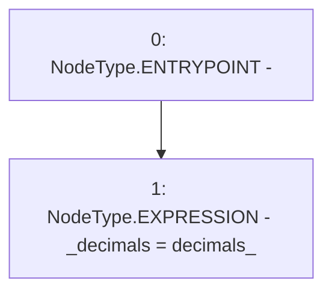

# Context: Token._setupDecimals

**Contract:** `Token` (Inherits: Ownable, ERC20, IERC20, Context)
**Signature:** `_setupDecimals(uint8)`
**Method Selector ID:** `Internal (No Method ID)`
**Visibility:** `internal`
**Environment-Free:** `Yes`
**Modifiers:** None

### State Variables Interaction
- **Reads:** None
- **Writes:** _decimals

### Environment & Verification Flags
- **Uses Foundry Cheatcodes:** No
- **Has Echidna Properties:** No

### Internal Calls Tree
- None

### External Calls / Value Transfers
- None

### Control Flow Graph (CFG)


### Source Mapping
Declared in: `node_modules/@openzeppelin/contracts/token/ERC20/ERC20.sol` on lines **287** to **289**

```solidity
    function _setupDecimals(uint8 decimals_) internal virtual {
        _decimals = decimals_;
    }

```
