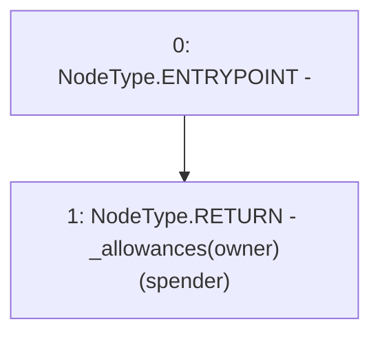

# Context: Token.allowance

**Contract:** `Token` (Inherits: Ownable, ERC20, IERC20, Context)
**Signature:** `allowance(address,address) returns (uint256)`
**Method Selector ID:** `0xdd62ed3e`
**Visibility:** `public`
**Environment-Free:** `Yes`
**Modifiers:** None

### State Variables Interaction
- **Reads:** _allowances
- **Writes:** None

### Environment & Verification Flags
- **Uses Foundry Cheatcodes:** No
- **Has Echidna Properties:** No

### Internal Calls Tree
- None

### External Calls / Value Transfers
- None

### Control Flow Graph (CFG)


### Source Mapping
Declared in: `node_modules/@openzeppelin/contracts/token/ERC20/ERC20.sol` on lines **123** to **125**

```solidity
    function allowance(address owner, address spender) public view virtual override returns (uint256) {
        return _allowances[owner][spender];
    }

```
