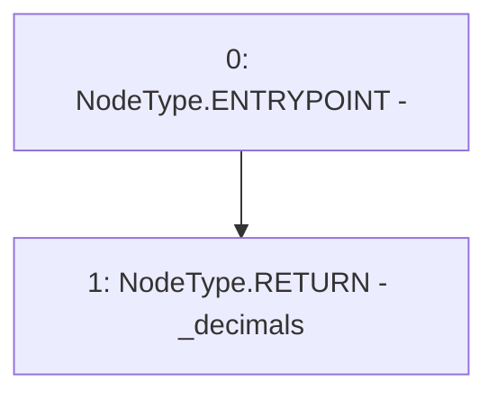

# Context: Token.decimals

**Contract:** `Token` (Inherits: Ownable, ERC20, IERC20, Context)
**Signature:** `decimals() returns (uint8)`
**Method Selector ID:** `0x313ce567`
**Visibility:** `public`
**Environment-Free:** `Yes`
**Modifiers:** None

### State Variables Interaction
- **Reads:** _decimals
- **Writes:** None

### Environment & Verification Flags
- **Uses Foundry Cheatcodes:** No
- **Has Echidna Properties:** No

### Internal Calls Tree
- None

### External Calls / Value Transfers
- None

### Control Flow Graph (CFG)


### Source Mapping
Declared in: `node_modules/@openzeppelin/contracts/token/ERC20/ERC20.sol` on lines **89** to **91**

```solidity
    function decimals() public view virtual returns (uint8) {
        return _decimals;
    }

```
