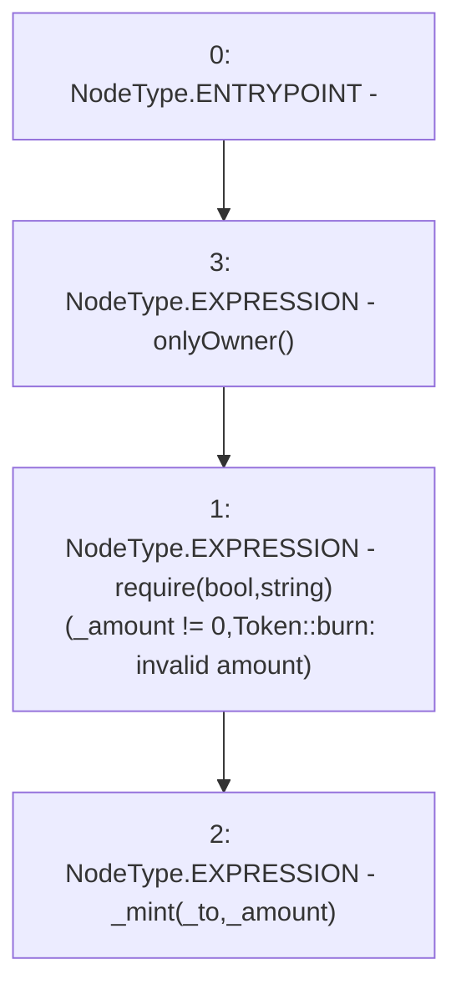

# Context: Token.mint

**Contract:** `Token` (Inherits: Ownable, ERC20, IERC20, Context)
**Signature:** `mint(address,uint256)`
**Method Selector ID:** `0x40c10f19`
**Visibility:** `external`
**Environment-Free:** `No (reads EVM state context)`
**Modifiers:**
- `onlyOwner`
  ```solidity
  modifier onlyOwner() {
          require(owner() == _msgSender(), "Ownable: caller is not the owner");
          _;
      }
  ```

### State Variables Interaction
- **Reads:** None
- **Writes:** None

### Assertion Checks & Business Requirements
- require/assert: `require(bool,string)(_amount != 0,Token::burn: invalid amount)`

### Environment & Verification Flags
- **Uses Foundry Cheatcodes:** No
- **Has Echidna Properties:** No

### Internal Calls Tree
- None

### External Calls / Value Transfers
- None

### Control Flow Graph (CFG)


### Source Mapping
Declared in: `contracts/mocks/Token.sol` on lines **16** to **19**

```solidity
    function mint(address _to, uint256 _amount) external onlyOwner {
        require(_amount != 0, 'Token::burn: invalid amount');
        _mint(_to, _amount);
    }

```
