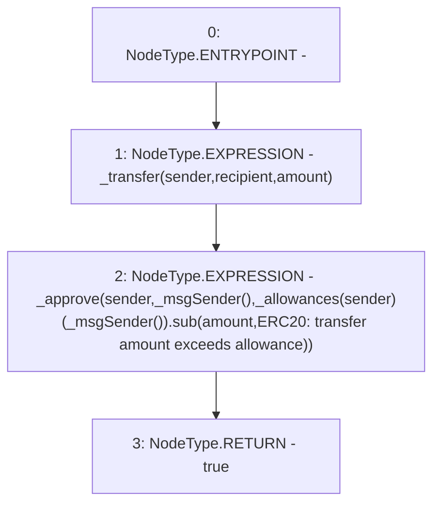

# Context: Token.transferFrom

**Contract:** `Token` (Inherits: Ownable, ERC20, IERC20, Context)
**Signature:** `transferFrom(address,address,uint256) returns (bool)`
**Method Selector ID:** `0x23b872dd`
**Visibility:** `public`
**Environment-Free:** `No (reads EVM state context)`
**Modifiers:** None

### State Variables Interaction
- **Reads:** _allowances
- **Writes:** None

### Environment & Verification Flags
- **Uses Foundry Cheatcodes:** No
- **Has Echidna Properties:** No

### Internal Calls Tree
- None

### External Calls / Value Transfers
- `SafeMath.TMP_2906(uint256) = LIBRARY_CALL, dest:SafeMath, function:SafeMath.sub(uint256,uint256,string), arguments:['REF_1348', 'amount', 'ERC20: transfer amount exceeds allowance'] `

### Control Flow Graph (CFG)


### Source Mapping
Declared in: `node_modules/@openzeppelin/contracts/token/ERC20/ERC20.sol` on lines **152** to **156**

```solidity
    function transferFrom(address sender, address recipient, uint256 amount) public virtual override returns (bool) {
        _transfer(sender, recipient, amount);
        _approve(sender, _msgSender(), _allowances[sender][_msgSender()].sub(amount, "ERC20: transfer amount exceeds allowance"));
        return true;
    }

```
