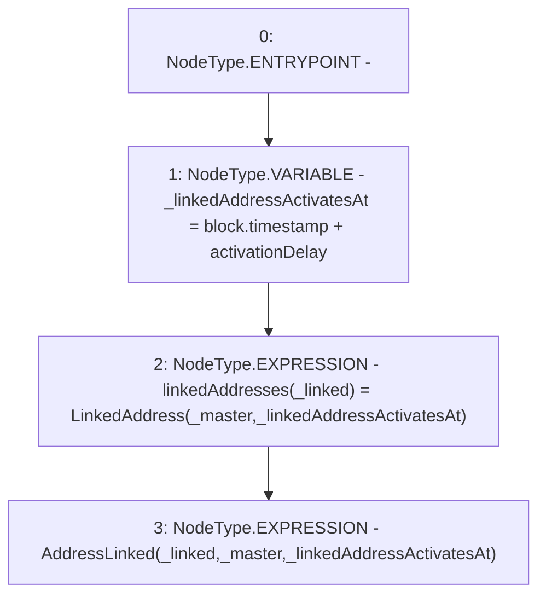

# Context: Verification._linkAddress

**Contract:** `Verification` (Inherits: OwnableUpgradeable, ContextUpgradeable, IVerification, Initializable)
**Signature:** `_linkAddress(address,address)`
**Method Selector ID:** `Internal (No Method ID)`
**Visibility:** `internal`
**Environment-Free:** `No (reads EVM state context)`
**Modifiers:** None

### State Variables Interaction
- **Reads:** activationDelay
- **Writes:** linkedAddresses

### Environment & Verification Flags
- **Uses Foundry Cheatcodes:** No
- **Has Echidna Properties:** No

### Internal Calls Tree
- None

### External Calls / Value Transfers
- None

### Control Flow Graph (CFG)


### Source Mapping
Declared in: `contracts/Verification/Verification.sol` on lines **112** to **116**

```solidity
    function _linkAddress(address _linked, address _master) internal {
        uint256 _linkedAddressActivatesAt = block.timestamp + activationDelay;
        linkedAddresses[_linked] = LinkedAddress(_master, _linkedAddressActivatesAt);
        emit AddressLinked(_linked, _master, _linkedAddressActivatesAt);
    }

```
