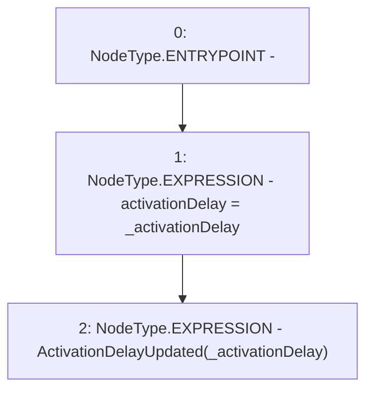

# Context: Verification._updateActivationDelay

**Contract:** `Verification` (Inherits: OwnableUpgradeable, ContextUpgradeable, IVerification, Initializable)
**Signature:** `_updateActivationDelay(uint256)`
**Method Selector ID:** `Internal (No Method ID)`
**Visibility:** `internal`
**Environment-Free:** `Yes`
**Modifiers:** None

### State Variables Interaction
- **Reads:** None
- **Writes:** activationDelay

### Environment & Verification Flags
- **Uses Foundry Cheatcodes:** No
- **Has Echidna Properties:** No

### Internal Calls Tree
- None

### External Calls / Value Transfers
- None

### Control Flow Graph (CFG)


### Source Mapping
Declared in: `contracts/Verification/Verification.sol` on lines **60** to **63**

```solidity
    function _updateActivationDelay(uint256 _activationDelay) internal {
        activationDelay = _activationDelay;
        emit ActivationDelayUpdated(_activationDelay);
    }

```
