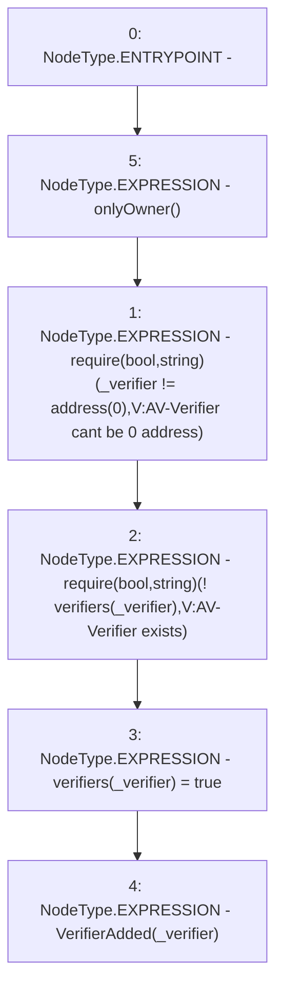

# Context: Verification.addVerifier

**Contract:** `Verification` (Inherits: OwnableUpgradeable, ContextUpgradeable, IVerification, Initializable)
**Signature:** `addVerifier(address)`
**Method Selector ID:** `0x9000b3d6`
**Visibility:** `external`
**Environment-Free:** `No (reads EVM state context)`
**Modifiers:**
- `onlyOwner`
  ```solidity
  modifier onlyOwner() {
          require(owner() == _msgSender(), "Ownable: caller is not the owner");
          _;
      }
  ```

### State Variables Interaction
- **Reads:** verifiers
- **Writes:** verifiers

### Assertion Checks & Business Requirements
- require/assert: `require(bool,string)(_verifier != address(0),V:AV-Verifier cant be 0 address)`
- require/assert: `require(bool,string)(! verifiers[_verifier],V:AV-Verifier exists)`

### Environment & Verification Flags
- **Uses Foundry Cheatcodes:** No
- **Has Echidna Properties:** No

### Internal Calls Tree
- None

### External Calls / Value Transfers
- None

### Control Flow Graph (CFG)


### Source Mapping
Declared in: `contracts/Verification/Verification.sol` on lines **68** to **73**

```solidity
    function addVerifier(address _verifier) external onlyOwner {
        require(_verifier != address(0), 'V:AV-Verifier cant be 0 address');
        require(!verifiers[_verifier], 'V:AV-Verifier exists');
        verifiers[_verifier] = true;
        emit VerifierAdded(_verifier);
    }

```
