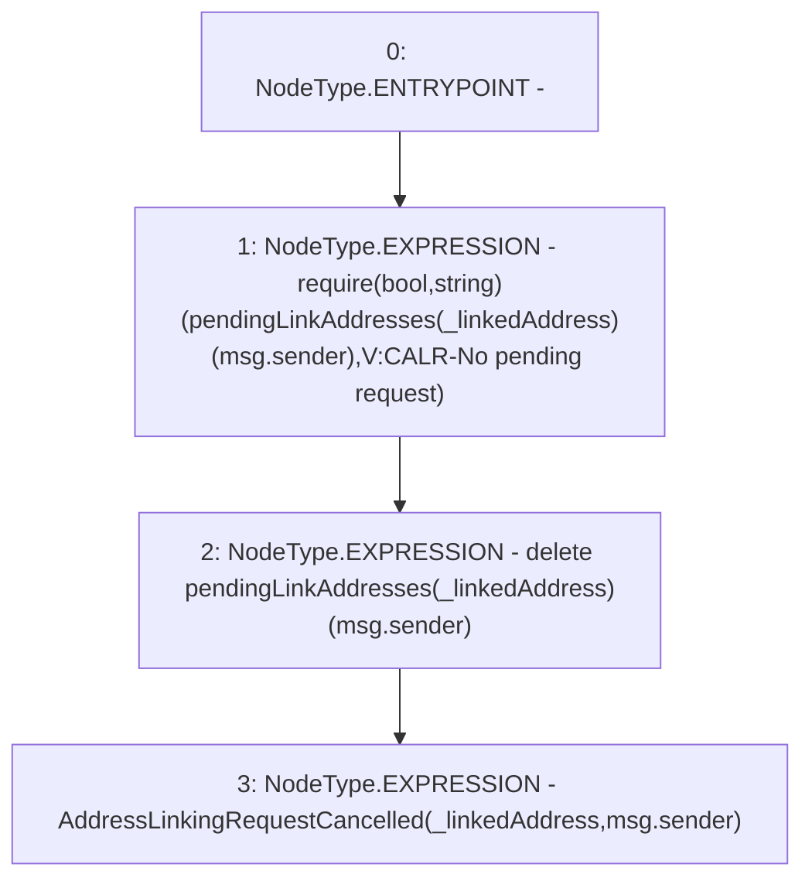

# Context: Verification.cancelAddressLinkingRequest

**Contract:** `Verification` (Inherits: OwnableUpgradeable, ContextUpgradeable, IVerification, Initializable)
**Signature:** `cancelAddressLinkingRequest(address)`
**Method Selector ID:** `0xc5fa0926`
**Visibility:** `external`
**Environment-Free:** `No (reads EVM state context)`
**Modifiers:** None

### State Variables Interaction
- **Reads:** pendingLinkAddresses
- **Writes:** pendingLinkAddresses

### Assertion Checks & Business Requirements
- require/assert: `require(bool,string)(pendingLinkAddresses[_linkedAddress][msg.sender],V:CALR-No pending request)`

### Environment & Verification Flags
- **Uses Foundry Cheatcodes:** No
- **Has Echidna Properties:** No

### Internal Calls Tree
- None

### External Calls / Value Transfers
- None

### Control Flow Graph (CFG)


### Source Mapping
Declared in: `contracts/Verification/Verification.sol` on lines **129** to **133**

```solidity
    function cancelAddressLinkingRequest(address _linkedAddress) external {
        require(pendingLinkAddresses[_linkedAddress][msg.sender], 'V:CALR-No pending request');
        delete pendingLinkAddresses[_linkedAddress][msg.sender];
        emit AddressLinkingRequestCancelled(_linkedAddress, msg.sender);
    }

```
