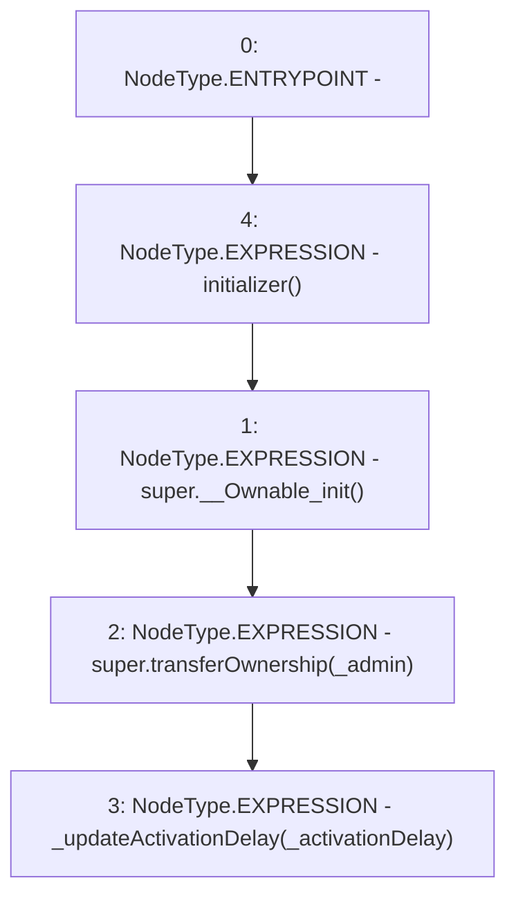

# Context: Verification.initialize

**Contract:** `Verification` (Inherits: OwnableUpgradeable, ContextUpgradeable, IVerification, Initializable)
**Signature:** `initialize(address,uint256)`
**Method Selector ID:** `0xcd6dc687`
**Visibility:** `external`
**Environment-Free:** `No (reads EVM state context)`
**Modifiers:**
- `initializer`
  ```solidity
  modifier initializer() {
          require(_initializing || _isConstructor() || !_initialized, "Initializable: contract is already initialized");
  
          bool isTopLevelCall = !_initializing;
          if (isTopLevelCall) {
              _initializing = true;
              _initialized = true;
          }
  
          _;
  
          if (isTopLevelCall) {
              _initializing = false;
          }
      }
  ```

### State Variables Interaction
- **Reads:** None
- **Writes:** None

### Environment & Verification Flags
- **Uses Foundry Cheatcodes:** No
- **Has Echidna Properties:** No

### Internal Calls Tree
- None

### External Calls / Value Transfers
- None

### Control Flow Graph (CFG)


### Source Mapping
Declared in: `contracts/Verification/Verification.sol` on lines **48** to **52**

```solidity
    function initialize(address _admin, uint256 _activationDelay) external initializer {
        super.__Ownable_init();
        super.transferOwnership(_admin);
        _updateActivationDelay(_activationDelay);
    }

```
