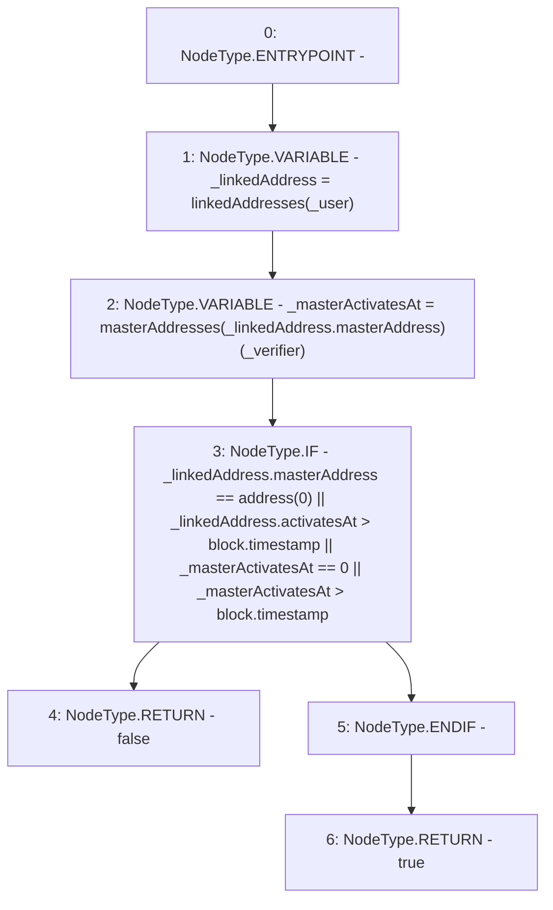

# Context: Verification.isUser

**Contract:** `Verification` (Inherits: OwnableUpgradeable, ContextUpgradeable, IVerification, Initializable)
**Signature:** `isUser(address,address) returns (bool)`
**Method Selector ID:** `0x02d43dc8`
**Visibility:** `external`
**Environment-Free:** `No (reads EVM state context)`
**Modifiers:** None

### State Variables Interaction
- **Reads:** linkedAddresses, masterAddresses
- **Writes:** None

### Environment & Verification Flags
- **Uses Foundry Cheatcodes:** No
- **Has Echidna Properties:** No

### Internal Calls Tree
- None

### External Calls / Value Transfers
- None

### Control Flow Graph (CFG)


### Source Mapping
Declared in: `contracts/Verification/Verification.sol` on lines **161** to **173**

```solidity
    function isUser(address _user, address _verifier) external view override returns (bool) {
        LinkedAddress memory _linkedAddress = linkedAddresses[_user];
        uint256 _masterActivatesAt = masterAddresses[_linkedAddress.masterAddress][_verifier];
        if (
            _linkedAddress.masterAddress == address(0) ||
            _linkedAddress.activatesAt > block.timestamp ||
            _masterActivatesAt == 0 ||
            _masterActivatesAt > block.timestamp
        ) {
            return false;
        }
        return true;
    }

```
